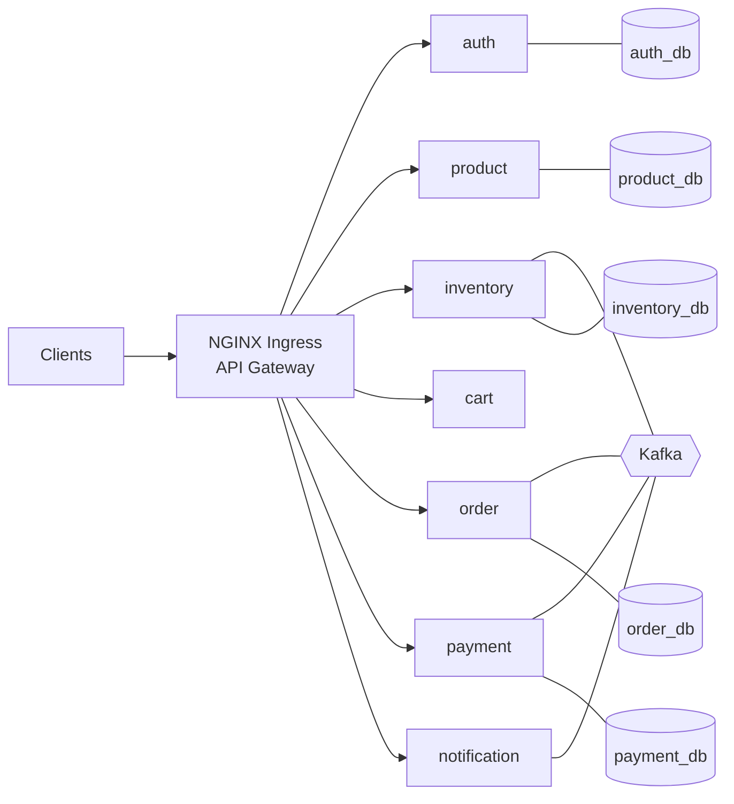

# E-Commerce Platform

Production-grade, cloud-native, **Kubernetes-native** e-commerce platform built with Java 21, Spring Boot 3.x, PostgreSQL, Apache Kafka, and a full observability stack (Prometheus, Grafana, Loki, Tempo, OpenTelemetry).

> **No Eureka · No Config Server · No Ribbon · No Hystrix.**
> Service discovery via **Kubernetes Services + DNS**; resilience via **Resilience4j**.

---

## Architecture at a glance



## Microservices

> **Edge / API gateway:** Kubernetes **NGINX Ingress Controller** (TLS, routing, rate limit, CORS) — not a service; routes `/api/*` to the services below. See [docs/05](docs/05-api-gateway-design.md).

| Service | Port | Database | Responsibility |
|---|---|---|---|
| auth-service | 8081 | auth_db | Registration, login, JWT, refresh, RBAC |
| product-service | 8082 | product_db | Product CRUD, categories, search |
| inventory-service | 8083 | inventory_db | Stock, reservation, release |
| cart-service | 8084 | cart_db | Cart management |
| order-service | 8085 | order_db | Orders, saga orchestration |
| payment-service | 8086 | payment_db | Payment simulation, events |
| notification-service | 8087 | notification_db | Email notifications |
| kyc-service | 8088 | kyc_db | KYC/compliance: ID-document extraction, sanctions screening |

## Tech Stack

- **Runtime:** Java 21, Spring Boot 3.x, Spring Security; edge = Kubernetes NGINX Ingress Controller
- **Data:** PostgreSQL, Spring Data JPA, Hibernate, Flyway
- **Messaging:** Apache Kafka (choreographed Saga)
- **Sync comms:** REST + OpenFeign
- **Resilience:** Resilience4j (circuit breaker, retry, rate limiter, bulkhead, timeout)
- **Observability:** Micrometer + Prometheus + Grafana + Loki + Promtail + Tempo + OpenTelemetry
- **Packaging:** Docker (multi-stage, non-root), Docker Compose, Kubernetes (Minikube)
- **AI (Phase 14, kyc-service):** Spring AI — chat/vision via Claude `claude-opus-4-8` (or a local Ollama model); local Transformers embeddings + pgvector for sanctions screening. See [docs/20](docs/20-local-setup-and-ai-roadmap.md).

> **Local-only project — no CI/CD.** This platform runs on a developer machine (Docker Compose / Minikube). There is intentionally no CI/CD pipeline. See [docs/20 — Local Setup & AI Roadmap](docs/20-local-setup-and-ai-roadmap.md).

## Documentation

| Doc | Contents |
|---|---|
| [01 — High-Level Architecture](docs/01-high-level-architecture.md) | C4 diagrams, saga flow, observability plane |
| [02 — Service Responsibilities](docs/02-service-responsibilities.md) | Per-service scope, endpoints, layering |
| [03 — Database Design](docs/03-database-design.md) | ER diagrams, schemas, Flyway strategy |
| [04 — Kafka Topic Design](docs/04-kafka-topic-design.md) | Topics, event envelope, saga events, reliability |
| [05 — API Gateway Design](docs/05-api-gateway-design.md) | NGINX Ingress: routing, TLS, rate limiting, CORS, security headers |
| [06 — Security Architecture](docs/06-security-architecture.md) | JWT/RS256, RBAC, secrets, TLS |
| [07 — Folder Structure](docs/07-folder-structure.md) | Monorepo + Clean Architecture layout |
| [08 — Infrastructure Setup](docs/08-infrastructure-setup.md) | docker-compose + observability pipeline |
| [09 — Kubernetes Setup](docs/09-kubernetes-setup.md) | Minikube manifests, ingress, secrets, deploy |
| [10 — Auth Service](docs/10-auth-service.md) | Phase 4: JWT RS256, refresh rotation, RBAC |
| [11 — Product Service](docs/11-product-service.md) | Phase 5: CRUD, categories, search, caching |
| [12 — Inventory Service](docs/12-inventory-service.md) | Phase 6: stock + reserve/release saga, Kafka |
| [13 — Cart Service](docs/13-cart-service.md) | Phase 7: cart CRUD, OpenFeign + circuit breaker |
| [14 — Order Service](docs/14-order-service.md) | Phase 8: saga initiator, order lifecycle, metrics |
| [15 — Payment Service](docs/15-payment-service.md) | Phase 9: payment simulation, payment events |
| [16 — Notification Service](docs/16-notification-service.md) | Phase 10: email on order.confirmed + payment.completed, audit log |
| [17 — Integration Testing](docs/17-integration-testing.md) | Phase 12: Testcontainers ITs (Postgres+Kafka), flow + saga, env fixes |
| [18 — Frontend](docs/18-frontend.md) | React storefront + admin console: stack, auth, dev proxy, async order tracking |
| [19 — KYC/Compliance Service](docs/19-kyc-compliance-service.md) | Phase 14: Spring AI (Claude vision/chat + local-embedding sanctions screening), KYC saga, order checkout gating |
| [20 — Local Setup & AI Roadmap](docs/20-local-setup-and-ai-roadmap.md) | Local-only architecture (no CI/CD), running it all free with Ollama, Spring AI next steps + free-tool stack |
| [21 — Roadmap & Next Steps](docs/21-roadmap-and-next-steps.md) | Tracked checklist: what's done + remaining stages (A run AI locally · B container e2e · C security follow-ups · D future), with owner + blockers |

## Frontend

Two React (Vite 5 + TypeScript + Tailwind) single-page apps under [`frontend/`](frontend/),
both calling the same `/api` front door. See [docs/18](docs/18-frontend.md).

| App | Path | Dev port | Audience |
|---|---|---|---|
| Storefront | [`frontend/storefront/`](frontend/storefront/) | 5173 | Customers — browse → cart → checkout → live order tracking |
| Admin console | [`frontend/admin/`](frontend/admin/) | 5174 | Admins — product/category CRUD + inventory |

```bash
cd frontend/storefront && npm install && npm run dev   # http://localhost:5173
cd frontend/admin      && npm install && npm run dev   # http://localhost:5174
```

## Delivery Phases

- [x] **Phase 1** — Architecture & design
- [x] **Phase 2** — Infrastructure: docker-compose + observability configs
- [x] **Phase 3** — Kubernetes manifests + Minikube setup
- [x] **Phase 4** — Auth Service ✅ _(compiles on JDK 21; 10/10 unit tests pass)_
- [x] **Phase 5** — Product Service ✅ _(compiles on JDK 21; 10/10 unit tests pass)_
- [x] **Phase 6** — Inventory Service ✅ _(compiles on JDK 21; 13/13 unit tests pass)_
- [x] **Phase 7** — Cart Service ✅ _(compiles on JDK 21; 11/11 unit tests pass)_
- [x] **Phase 8** — Order Service ✅ _(compiles on JDK 21; 13/13 unit tests pass)_
- [x] **Phase 9** — Payment Service ✅ _(compiles on JDK 21; 6/6 unit tests pass)_
- [x] **Phase 10** — Notification Service ✅ _(compiles on JDK 21; 10/10 unit tests pass)_
- [x] **Phase 11** — API Gateway (Kubernetes NGINX Ingress Controller) ✅ _(manifests + docs; validate with `kubectl apply --dry-run=client -R -f k8s/`)_
- [x] **Phase 12** — Integration testing ✅ _(Testcontainers Postgres+Kafka; 7/7 services' ITs green on JDK 21 + Docker; `mvn -Djacoco.skip=true verify`)_
- [x] **Phase 14** — KYC/Compliance Service (Spring AI) ✅ _(compiles on JDK 21; unit tests pass — module + auth `user.registered` producer + order checkout gating; security-reviewed + hardened (H1-H3, M1-M4 fixed); not yet container-verified end-to-end)_

> **Phase 13 (CI/CD) dropped** — this is a local-only project (see Tech Stack note above). The original 13-phase plan ended with a CI/CD pipeline; it is intentionally out of scope.

## Local quickstart (available from Phase 2)

```bash
# Infra + observability
cd infra && docker compose up -d

# Application services (after generating a dev JWT keypair — see file header)
mkdir -p infra/keys
openssl genrsa -out infra/keys/private.pem 2048
openssl rsa -in infra/keys/private.pem -pubout -out infra/keys/public.pem
docker compose -f services/docker-compose.apps.yml up -d --build

# Kubernetes (Minikube) — from Phase 3
minikube start --cpus=4 --memory=8192
minikube addons enable ingress          # required before the Ingress gateway
./k8s/deploy.sh                          # ordered apply: ns → secrets → infra → apps → TLS + ingress
minikube tunnel                          # exposes the Ingress on 127.0.0.1
# hosts file:  <minikube ip>  ecommerce.local grafana.local prometheus.local
curl -k https://ecommerce.local/api/products
```
