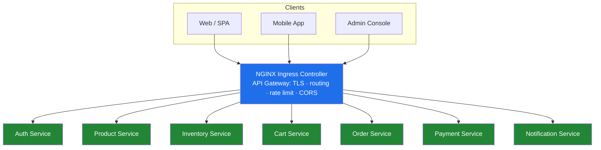
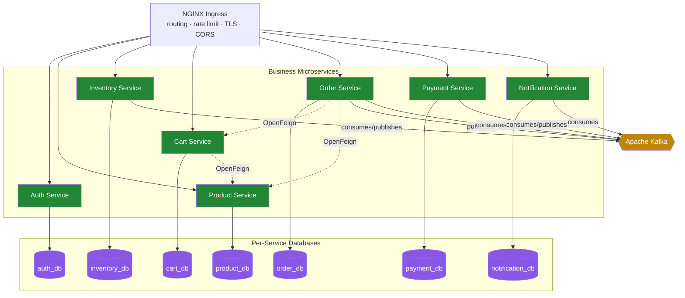
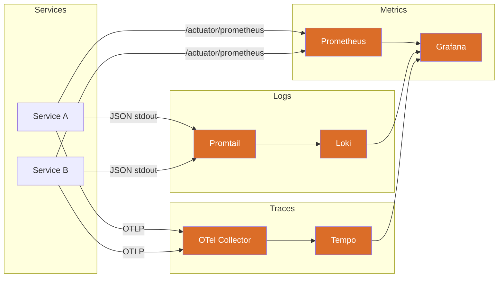
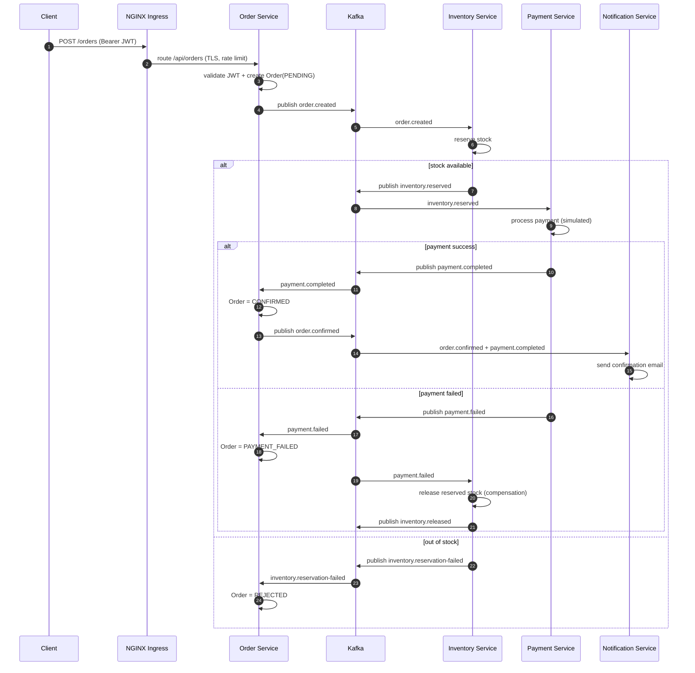

# Phase 1.1 — High-Level Architecture

> **Platform:** Cloud-native, Kubernetes-native E-Commerce Platform
> **Runtime:** Java 21 · Spring Boot 3.x · NGINX Ingress (edge) · PostgreSQL · Kafka
> **Principles:** Microservices · DDD · Clean Architecture · SOLID · Event-Driven · CQRS (selective) · Saga

---

## 1. Architectural Style

This platform is a set of **independently deployable microservices**, each owning its data and exposing a bounded context. There is **no Eureka, no Config Server, no Ribbon, no Hystrix** — by design.

| Concern | Cloud-native / K8s-native choice |
|---|---|
| Service discovery | **Kubernetes Services + Kubernetes DNS** (`<service>.<namespace>.svc.cluster.local`) |
| Client-side load balancing | Kubernetes Service (`ClusterIP`) + kube-proxy / IPVS |
| Configuration | **ConfigMaps** + Spring `application.yml` profiles (no Config Server) |
| Secrets | **Kubernetes Secrets** (mounted as env / volumes) |
| Resilience | **Resilience4j** (Circuit Breaker, Retry, Rate Limiter, Bulkhead, Timeout) |
| Edge / routing | **Kubernetes NGINX Ingress Controller** (TLS, routing, rate limit, CORS) — *is* the API gateway |
| Sync comms | REST + **OpenFeign** |
| Async comms | **Apache Kafka** |
| Distributed txns | **Saga (choreography)** over Kafka with compensating events |

---

## 2. System Context (C4 — Level 1)

---

## 3. Container Diagram (C4 — Level 2)

---

## 4. Observability Plane

Every service emits **metrics, logs, and traces** through a single correlated pipeline.

- **Metrics:** Micrometer → Prometheus → Grafana
- **Logs:** Logback JSON (with `traceId`/`spanId`/`correlationId`) → Promtail → Loki → Grafana
- **Traces:** OpenTelemetry SDK (auto-instrumentation) → OTLP → OTel Collector → Tempo → Grafana
- **Correlation:** A single `traceId` links a Grafana metric spike → its logs → its distributed trace.

---

## 5. Distributed Transaction — Order Saga (Choreography)

The critical "place order" flow is a **choreographed saga** over Kafka. No central orchestrator; each service reacts to events and emits compensating events on failure.

**Compensation summary**

| Failure point | Compensating action |
|---|---|
| Stock unavailable | Order → `REJECTED` (no payment attempted) |
| Payment failed | Order → `PAYMENT_FAILED`; Inventory releases reservation |
| Downstream consumer error | Kafka retry + DLT (dead-letter topic); idempotent consumers |

---

## 6. Cross-Cutting Concerns

| Concern | Where it lives |
|---|---|
| **AuthN** | Auth Service issues JWT; **each service** validates signature + expiry (RS256 resource server). Edge does TLS + rate limit, not token checks (see [05](05-api-gateway-design.md) §6) |
| **AuthZ** | RBAC (`ADMIN`, `CUSTOMER`) enforced per service (method-level `@PreAuthorize`) |
| **Idempotency** | Kafka consumers keyed by event id; DB unique constraints on saga keys |
| **Resilience** | Resilience4j on all Feign clients + Kafka producers |
| **Config** | ConfigMaps + Spring profiles (`local`, `docker`, `k8s`) |
| **Secrets** | Kubernetes Secrets (JWT keys, DB creds, Kafka SASL) |
| **Tracing context** | W3C `traceparent` propagated across REST (Feign interceptor) and Kafka headers |

---

## 7. Environments

| Env | How it runs | Discovery | Config | Secrets |
|---|---|---|---|---|
| **local** | IDE + `docker compose` for infra | localhost ports | `application-local.yml` | `.env` (dev only) |
| **docker** | Full `docker compose up -d` | compose service names | `application-docker.yml` | compose env |
| **k8s (Minikube)** | `kubectl apply -f k8s/` | K8s DNS | ConfigMaps | K8s Secrets |

See [02-service-responsibilities.md](02-service-responsibilities.md) for per-service detail.
