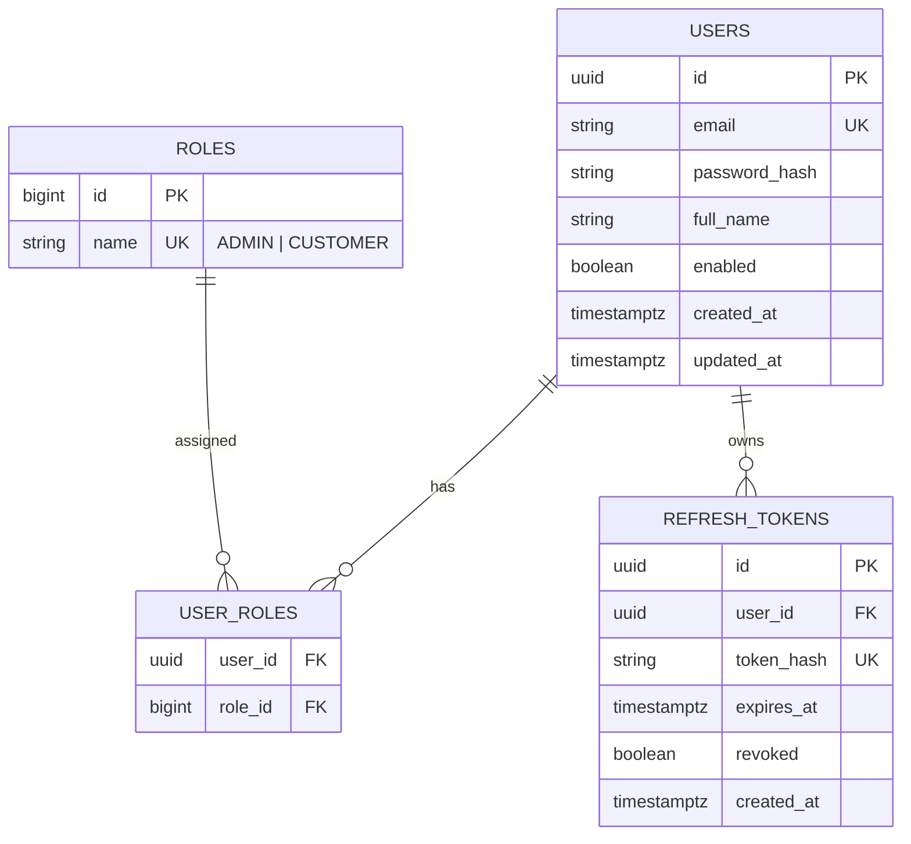
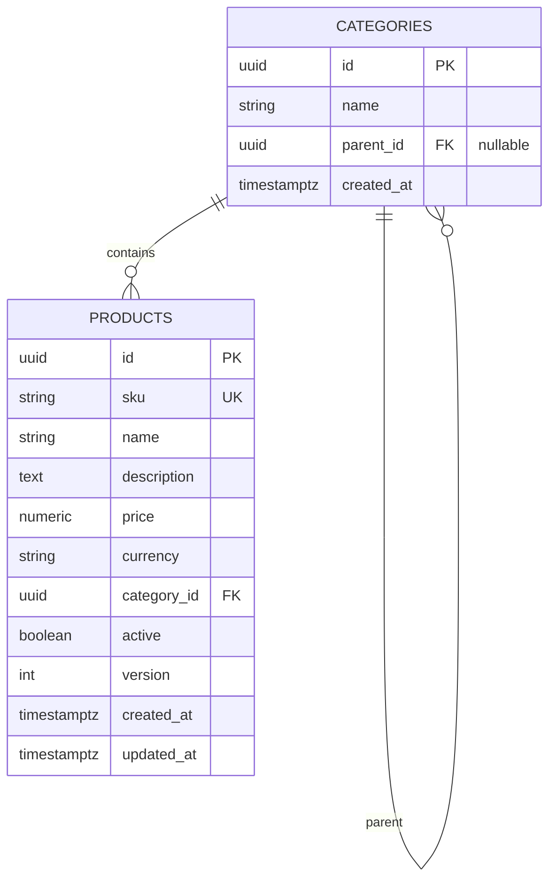
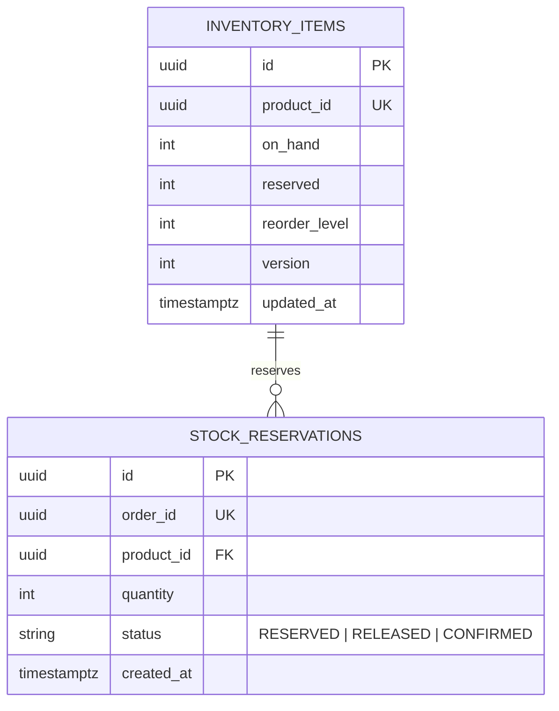
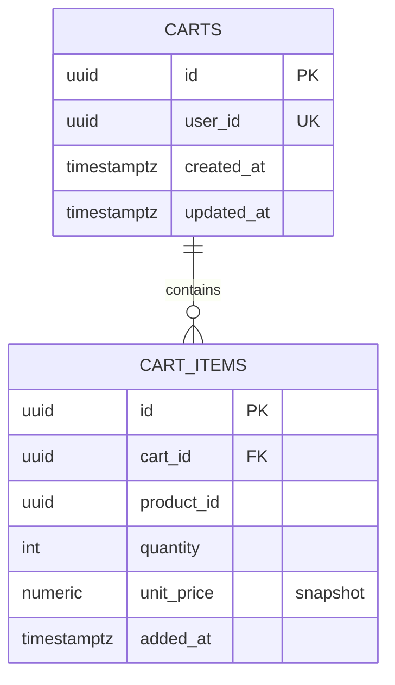
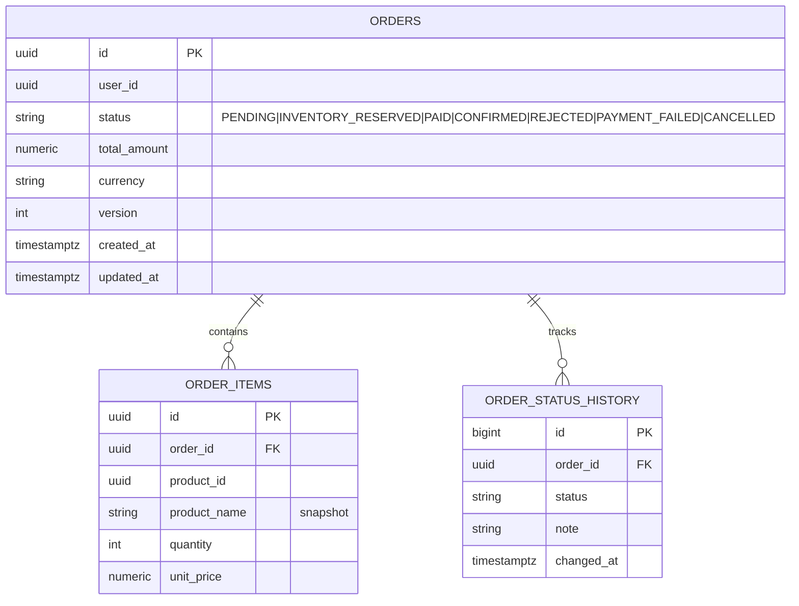
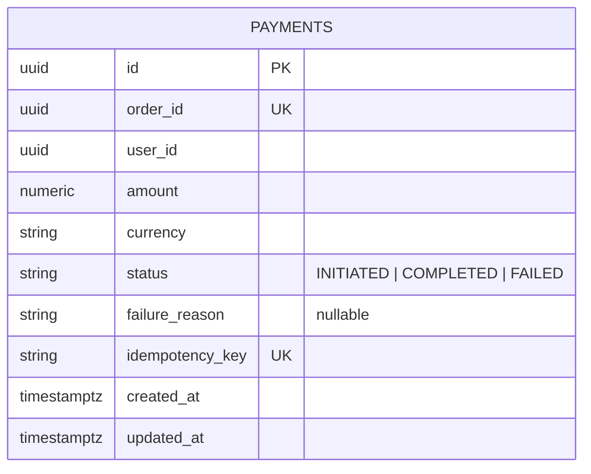
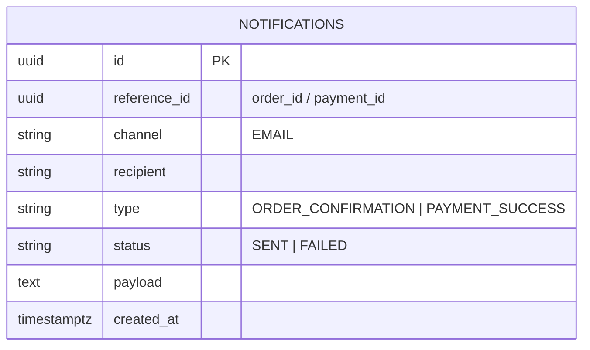

# Phase 1.3 — Database Design

**Pattern:** Database-per-service. No cross-service joins, no shared schema. Each service owns its PostgreSQL database; integration happens via REST/Kafka, never SQL.

- **ORM:** Spring Data JPA + Hibernate
- **Migrations:** Flyway (`V1__init.sql`, `V2__...` per service, under `src/main/resources/db/migration`)
- **IDs:** UUID (application-generated) for externally-referenced aggregates; BIGINT identity for internal-only rows
- **Money:** `NUMERIC(12,2)` + ISO currency code; never `float`/`double`
- **Auditing:** `created_at`, `updated_at`, `version` (optimistic locking) on mutable aggregates

---

## 1. ER Diagrams (per bounded context)

### 1.1 auth_db


### 1.2 product_db


### 1.3 inventory_db

> `available = on_hand - reserved`. Reservation uses optimistic locking (`version`) to prevent oversell.

### 1.4 cart_db


### 1.5 order_db


### 1.6 payment_db


### 1.7 notification_db


---

## 2. Flyway Migration Strategy

| Rule | Detail |
|---|---|
| Location | `src/main/resources/db/migration` per service |
| Naming | `V<version>__<description>.sql` (e.g. `V1__init.sql`) |
| Baseline | `V1__init.sql` creates tables + indexes + seed roles |
| Forward-only | Never edit an applied migration; add a new one |
| Validation | `spring.flyway.validate-on-migrate=true` |
| Per-env | Same scripts across local/docker/k8s; data seeding via separate `R__seed.sql` repeatable scripts in dev only |

**Example — `auth_db` `V1__init.sql` (skeleton, full version delivered in Phase 4):**
```sql
CREATE TABLE roles (
    id   BIGSERIAL PRIMARY KEY,
    name VARCHAR(32) NOT NULL UNIQUE
);
INSERT INTO roles (name) VALUES ('ADMIN'), ('CUSTOMER');

CREATE TABLE users (
    id            UUID PRIMARY KEY,
    email         VARCHAR(255) NOT NULL UNIQUE,
    password_hash VARCHAR(255) NOT NULL,
    full_name     VARCHAR(255),
    enabled       BOOLEAN NOT NULL DEFAULT TRUE,
    created_at    TIMESTAMPTZ NOT NULL DEFAULT now(),
    updated_at    TIMESTAMPTZ NOT NULL DEFAULT now()
);

CREATE TABLE user_roles (
    user_id UUID   NOT NULL REFERENCES users(id) ON DELETE CASCADE,
    role_id BIGINT NOT NULL REFERENCES roles(id),
    PRIMARY KEY (user_id, role_id)
);

CREATE TABLE refresh_tokens (
    id         UUID PRIMARY KEY,
    user_id    UUID NOT NULL REFERENCES users(id) ON DELETE CASCADE,
    token_hash VARCHAR(255) NOT NULL UNIQUE,
    expires_at TIMESTAMPTZ NOT NULL,
    revoked    BOOLEAN NOT NULL DEFAULT FALSE,
    created_at TIMESTAMPTZ NOT NULL DEFAULT now()
);
CREATE INDEX idx_refresh_tokens_user ON refresh_tokens(user_id);
```

---

## 3. Indexing & Performance Notes

| Table | Index | Reason |
|---|---|---|
| `products` | `(category_id)`, `(name text_pattern_ops)`, `(active)` | search/filter |
| `inventory_items` | `(product_id)` unique | hot-path reservation lookup |
| `orders` | `(user_id, created_at desc)` | order history pagination |
| `payments` | `(order_id)` unique, `(idempotency_key)` unique | idempotency |
| `refresh_tokens` | `(token_hash)` unique, `(user_id)` | login/refresh |

---

## 4. PostgreSQL Topology

- **One PostgreSQL instance** per environment with **one database per service** (logical isolation), OR a StatefulSet per DB in K8s for stronger isolation.
- Local/docker: single Postgres container, multiple DBs created via init script.
- K8s: PostgreSQL StatefulSet + PVC; credentials from Kubernetes Secrets; each service points at its own DB via ConfigMap `SPRING_DATASOURCE_URL`.

See [04-kafka-topic-design.md](04-kafka-topic-design.md).
