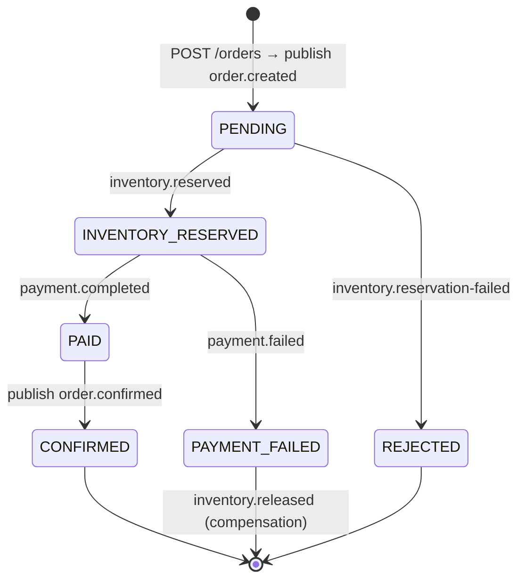

# Phase 1.4 — Kafka Topic Design

**Pattern:** Event-Driven Architecture + **choreographed Saga**. Topics model **domain events** (past-tense facts), not commands. Producers own their topics; consumers are idempotent.

---

## 1. Topic Catalog

| Topic | Producer | Consumers | Key | Purpose |
|---|---|---|---|---|
| `order.created` | order-service | inventory-service | `orderId` | Saga start — reserve stock |
| `inventory.reserved` | inventory-service | payment-service | `orderId` | Stock held — proceed to payment |
| `inventory.reservation-failed` | inventory-service | order-service | `orderId` | Out of stock — reject order |
| `inventory.released` | inventory-service | order-service | `orderId` | Compensation done (audit) |
| `payment.completed` | payment-service | order-service, notification-service | `orderId` | Payment ok — confirm order |
| `payment.failed` | payment-service | order-service, inventory-service | `orderId` | Payment failed — compensate |
| `order.confirmed` | order-service | notification-service | `orderId` | Order finalized — notify customer |
| `*.DLT` | (Spring Kafka) | ops / alerting | — | Dead-letter for poison messages |

> **Keying by `orderId`** guarantees ordering of all events for a single order within a partition, which the saga relies on.

---

## 2. Topic Configuration (defaults)

| Setting | Value | Rationale |
|---|---|---|
| Partitions | 6 (business topics) | parallelism; ordering preserved per `orderId` |
| Replication factor | 3 (prod) / 1 (local) | durability |
| `min.insync.replicas` | 2 (prod) | no data loss on single broker failure |
| Retention | 7 days | replay / audit window |
| Cleanup policy | `delete` | event log, not compacted state |
| Producer acks | `all` | durability for saga events |
| Idempotent producer | `enabled` | exactly-once produce semantics |

DLT topics: `<topic>.DLT`, 1 partition, longer retention (30d).

---

## 3. Event Envelope (standard schema)

All events share a common envelope (JSON; Avro/Schema Registry optional in later phase):

```json
{
  "eventId": "uuid",
  "eventType": "order.created",
  "version": 1,
  "occurredAt": "2026-06-10T10:15:30Z",
  "traceId": "w3c-trace-id",
  "correlationId": "uuid",
  "payload": { }
}
```

- `eventId` → consumer idempotency key (dedupe on a `processed_events` table or in-memory cache).
- `traceId`/`correlationId` propagated into Kafka **headers** (`traceparent`) so traces span async hops.

### Payload examples

`order.created`
```json
{
  "orderId": "…", "userId": "…", "currency": "USD",
  "items": [{ "productId": "…", "quantity": 2, "unitPrice": 19.99 }],
  "totalAmount": 39.98
}
```

`inventory.reserved`
```json
{ "orderId": "…", "reservations": [{ "productId": "…", "quantity": 2 }] }
```

`payment.completed`
```json
{ "orderId": "…", "paymentId": "…", "amount": 39.98, "currency": "USD" }
```

`payment.failed`
```json
{ "orderId": "…", "reason": "INSUFFICIENT_FUNDS" }
```

---

## 4. Saga Event Flow (state transitions)



| Event in | Service reaction | Event out |
|---|---|---|
| `order.created` | inventory reserves stock | `inventory.reserved` / `inventory.reservation-failed` |
| `inventory.reserved` | payment processes | `payment.completed` / `payment.failed` |
| `payment.completed` | order → CONFIRMED | `order.confirmed` |
| `payment.failed` | order → PAYMENT_FAILED; inventory releases | `inventory.released` |
| `inventory.reservation-failed` | order → REJECTED | — |
| `order.confirmed` + `payment.completed` | notification sends email | — |

---

## 5. Reliability & Idempotency

| Concern | Approach |
|---|---|
| Duplicate delivery | Idempotent consumers — dedupe by `eventId` (unique constraint on `processed_events`) |
| Poison messages | Spring Kafka `DefaultErrorHandler` + `DeadLetterPublishingRecoverer` → `<topic>.DLT` |
| Retry | Non-blocking retry topics (`@RetryableTopic`) with backoff before DLT |
| Lost updates (stock) | Optimistic locking on `inventory_items.version` |
| Ordering | Partition key = `orderId` |
| Atomicity (DB + publish) | **Transactional Outbox** pattern (later phase) — write event to `outbox` table in same txn, relay to Kafka |
| Consumer lag | Monitored via `kafka_consumergroup_lag` → Grafana alert |

---

## 6. Consumer Groups

| Service | Group id |
|---|---|
| inventory-service | `inventory-service` |
| payment-service | `payment-service` |
| order-service | `order-service` |
| notification-service | `notification-service` |

One group per service → each service processes each event once (scaled across pods via partitions).

See [05-api-gateway-design.md](05-api-gateway-design.md).
