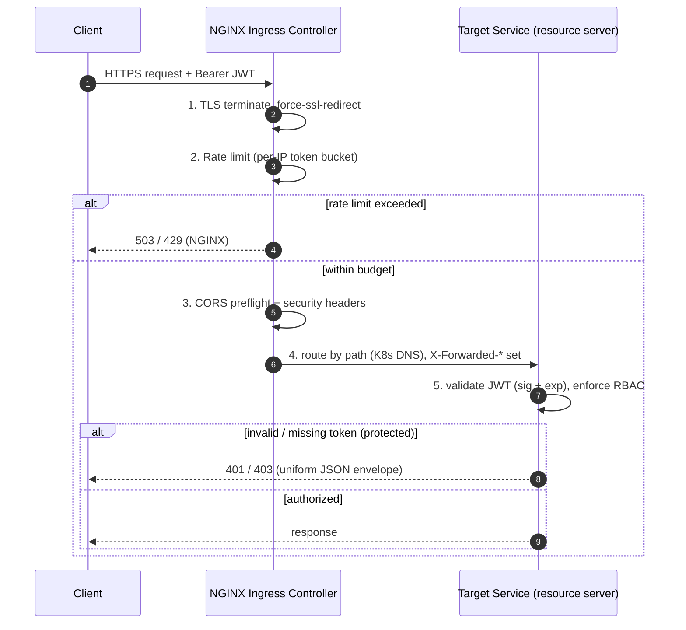

# Phase 1.5 / Phase 11 — API Gateway (NGINX Ingress Controller)

**Technology:** **Kubernetes NGINX Ingress Controller** (`ingress-nginx`, community). The edge / north-south entrypoint for all API traffic. **No Spring Cloud Gateway, no Eureka, no Ribbon** — routing targets resolve via **Kubernetes Services + DNS**.

> **Why the change:** The gateway's job (TLS termination, routing, rate limiting, CORS, security headers) is pure L7 edge concern. Running it as the Ingress Controller — the most common cloud-native pattern — removes a bespoke Spring service to build, secure, and scale. The Ingress Controller *is* the gateway; there is no `api-gateway` deployment.

---

## 1. Responsibilities

| Capability | Implementation (NGINX Ingress) |
|---|---|
| TLS termination | `spec.tls` + `ecommerce-tls` secret; HSTS + TLS 1.2/1.3 via controller ConfigMap |
| Routing | Path-based rules (`/api/<ctx>` → Service:port) over Kubernetes DNS |
| Rate limiting | `limit-rps` / `limit-connections` annotations (per client IP); stricter on `/api/auth` |
| CORS | `enable-cors` + `cors-allow-*` annotations, centralized at the edge |
| Security headers | Controller `add-headers` ConfigMap (X-Frame-Options, X-Content-Type-Options, Referrer-Policy, …) + HSTS |
| Body / timeout limits | `proxy-body-size`, `proxy-*-timeout` annotations |
| Real client IP | `use-forwarded-headers` + `enable-real-ip` |
| **JWT validation** | **Performed by each backend service** (RS256 resource server) — *not* at the edge. See §6. |

---

## 2. Route Table

Controllers already live under `/api/<ctx>`, so **no path rewrite** is applied — the original path is forwarded unchanged. Host: `ecommerce.local`.

| Path (Prefix) | Target (K8s DNS) | Auth (enforced by the service) |
|---|---|---|
| `/api/auth` | `auth-service:8081` | public: register/login/refresh; `GET /me` authenticated |
| `/api/products`, `/api/categories` | `product-service:8082` | GET public · writes `ADMIN` |
| `/api/inventory` | `inventory-service:8083` | `ADMIN` |
| `/api/cart` | `cart-service:8084` | `CUSTOMER` |
| `/api/orders` | `order-service:8085` | `CUSTOMER` (own) / `ADMIN` |
| `/api/payments` | `payment-service:8086` | `CUSTOMER` (own) / `ADMIN` |
| `/api/notifications` | `notification-service:8087` | authenticated |

`/api/auth` is a **separate Ingress object** so it can carry a stricter rate limit (brute-force protection) than the rest of the API. In NGINX, per-path policy = per-Ingress annotations.

Manifests: [`k8s/ingress.yaml`](../k8s/ingress.yaml) (routes + per-Ingress annotations), [`k8s/ingress-nginx-config.yaml`](../k8s/ingress-nginx-config.yaml) (controller-wide hardening).

---

## 3. Request Flow



---

## 4. Configuration (key annotations)

Business APIs Ingress:

```yaml
nginx.ingress.kubernetes.io/ssl-redirect: "true"
nginx.ingress.kubernetes.io/force-ssl-redirect: "true"
nginx.ingress.kubernetes.io/proxy-body-size: "10m"
nginx.ingress.kubernetes.io/limit-rps: "50"
nginx.ingress.kubernetes.io/limit-connections: "20"
nginx.ingress.kubernetes.io/enable-cors: "true"
nginx.ingress.kubernetes.io/cors-allow-origin: "https://ecommerce.local"
```

Controller ConfigMap (`ingress-nginx` namespace) — global hardening:

```yaml
ssl-protocols: "TLSv1.2 TLSv1.3"
hsts: "true"
server-tokens: "false"
use-forwarded-headers: "true"
add-headers: "ingress-nginx/custom-response-headers"
allow-snippet-annotations: "false"   # keep snippet CVE surface closed
```

---

## 5. Rate Limiting Policy

| Scope | Ingress | limit-rps | limit-connections |
|---|---|---|---|
| Business APIs | `ecommerce-api-ingress` | 50 | 20 |
| Auth (login/refresh) | `ecommerce-auth-ingress` | 5 | 10 |

Keyed by client IP (`$binary_remote_addr`); burst = `limit-rps × limit-burst-multiplier`. No Redis required — NGINX rate limiting is in-process per controller replica. (Redis remains in the platform for product-service caching, not for the gateway.)

---

## 6. Security Boundary — where JWT validation lives

The community NGINX Ingress Controller has **no built-in JWT verification**. This platform keeps validation **in each service** (every service is an RS256 OAuth2 resource server validating signature + expiry against the auth-service public key), which is:

- **Zero-trust / defense-in-depth** — a service never blindly trusts an upstream; compromise of the edge does not bypass auth.
- **Zero rework** — validation already shipped in Phases 4–10.

Only the Ingress is exposed; all services are `ClusterIP` (cluster-internal). A client cannot reach a service except through the Ingress.

### Optional: validate at the edge (external auth)

If edge fail-fast is desired, add an auth endpoint and wire it with:

```yaml
nginx.ingress.kubernetes.io/auth-url: "http://auth-service.ecommerce.svc.cluster.local:8081/api/auth/validate"
nginx.ingress.kubernetes.io/auth-response-headers: "X-User-Id, X-User-Roles"
```

This requires a lightweight `GET /api/auth/validate` in auth-service (verify token, return 200 + identity headers, or 401). Not enabled by default — it adds a per-request hop and duplicates work the services already do. `oauth2-proxy` is the heavier alternative.

---

## 7. Error envelope

Application errors keep the uniform JSON shape produced by each service's `GlobalExceptionHandler`:

```json
{ "timestamp": "...", "status": 401, "error": "Unauthorized",
  "message": "...", "path": "/api/orders", "fieldErrors": null }
```

Edge-level rejections (rate limit, TLS, routing) return NGINX's standard responses; customize via the controller's `custom-http-errors` + a default-backend if a unified body is required.

---

## 8. Deploy / verify

```bash
minikube addons enable ingress
./k8s/deploy.sh                      # creates ecommerce-tls, applies controller config + ingress
minikube tunnel                      # or use `minikube ip`
# hosts file:  <ip>  ecommerce.local grafana.local prometheus.local
curl -k https://ecommerce.local/api/products
kubectl apply --dry-run=client -R -f k8s/   # validate manifests
```

See [06-security-architecture.md](06-security-architecture.md) and [09-kubernetes-setup.md](09-kubernetes-setup.md).
