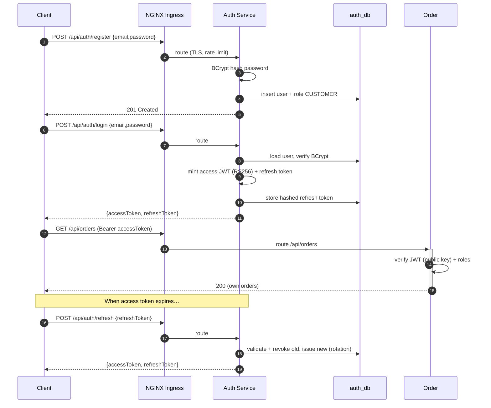
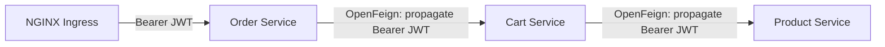

# Phase 1.6 — Security Architecture

**Goal:** Enterprise-grade AuthN/AuthZ with stateless JWT, RBAC, BCrypt, Kubernetes Secrets, and TLS-ready transport.

---

## 1. Authentication Model

| Element | Choice |
|---|---|
| Password hashing | **BCrypt** (strength 12) |
| Access token | **JWT** (signed), short-lived (15 min) |
| Refresh token | Opaque/random, hashed-at-rest, long-lived (7 days), **rotated** on use |
| Signing | **RS256 (asymmetric)** — Auth Service holds private key; every service verifies with the public key (JWKS) |
| Token transport | `Authorization: Bearer <jwt>` |
| Revocation | Refresh tokens revocable in `auth_db`; access tokens short-lived by design |

> RS256 (not HS256) so only Auth Service can mint tokens; everyone else only verifies with the public key — no shared secret sprawl.

### JWT Claims
```json
{
  "iss": "auth-service",
  "sub": "<user-uuid>",
  "email": "user@example.com",
  "roles": ["CUSTOMER"],
  "iat": 1718012130,
  "exp": 1718013030,
  "jti": "<token-id>"
}
```

---

## 2. Authentication Flow



---

## 3. Authorization (RBAC)

**Roles:** `ADMIN`, `CUSTOMER`.

| Resource / action | CUSTOMER | ADMIN |
|---|:--:|:--:|
| Register / login / refresh | ✅ | ✅ |
| Browse / search products | ✅ | ✅ |
| Create/update/delete product | ❌ | ✅ |
| Manage categories | ❌ | ✅ |
| Adjust inventory | ❌ | ✅ |
| View / mutate own cart | ✅ | ✅ |
| Place order / view own orders | ✅ | ✅ |
| View any order / all orders | ❌ | ✅ |
| View own payment status | ✅ | ✅ |

**Enforcement layers (defense in depth):**
1. **Edge (NGINX Ingress)** — TLS, rate limiting, CORS, security headers. Does **not** verify JWTs (community ingress has no JWT support); optional `auth-url` external-auth can fail-fast (see [05](05-api-gateway-design.md) §6).
2. **Service** — authentication (RS256 JWT signature + expiry) **and** fine-grained authorization: `@PreAuthorize("hasRole('ADMIN')")` / `@PreAuthorize("#userId == authentication.name")` for ownership. This is the real security boundary.

```java
// Example: method-level authorization in product-service
@PreAuthorize("hasRole('ADMIN')")
@PostMapping("/products")
public ProductResponse create(@Valid @RequestBody CreateProductRequest req) { … }
```

---

## 4. Service-to-Service Security



- The Ingress forwards the client's `Authorization` header unchanged; the **target service** verifies it.
- A **Feign request interceptor** copies the incoming `Authorization` header onto outbound calls → identity flows across hops.
- Each service runs the same JWT verification (public key from Secret/ConfigMap) — no service trusts an unverified upstream.
- **Optional external-auth:** wiring the Ingress `auth-url` to an auth-service `/validate` endpoint can inject trusted `X-User-*` headers at the edge; off by default (see [05](05-api-gateway-design.md) §6).

---

## 5. Secrets Management

| Secret | Stored as | Consumed by |
|---|---|---|
| JWT **private key** | K8s Secret `jwt-keys` | auth-service (volume mount) |
| JWT **public key** / JWKS | ConfigMap/Secret | all services |
| DB credentials | K8s Secret `<svc>-db-credentials` | each service (env) |
| Kafka credentials (SASL) | K8s Secret `kafka-credentials` | producers/consumers |
| SMTP credentials | K8s Secret `smtp-credentials` | notification-service |

- Local/docker: `.env` + compose secrets (dev only, never committed).
- K8s: `Secret` objects (base64); production should layer **Sealed Secrets / External Secrets Operator** (noted for hardening phase).

---

## 6. Transport Security (TLS-ready)

| Layer | TLS posture |
|---|---|
| Client → Ingress | TLS termination at NGINX Ingress (`ecommerce-tls` secret; dev self-signed, prod cert-manager); HSTS + TLS 1.2/1.3 |
| Ingress → Service | cluster-internal; mTLS-ready via mesh (optional) |
| Service → Service | HTTP within cluster by default; **TLS-ready** server config (keystore from Secret) for zero-trust |
| Service → Postgres/Kafka | `sslmode`/SASL_SSL configurable via ConfigMap/Secret |

Spring config exposes `server.ssl.*` driven by env, so enabling TLS is a config change, not a code change.

---

## 7. Hardening Checklist (tracked for later phases)

- [ ] Account lockout / brute-force throttling on login
- [ ] Refresh token reuse detection (revoke family on replay)
- [x] CORS allow-list per environment — NGINX Ingress `cors-allow-origin` annotations (Phase 11)
- [x] Security headers (HSTS, X-Frame-Options, X-Content-Type-Options, Referrer-Policy) at the NGINX Ingress (Phase 11; CSP still TODO)
- [ ] Secrets via External Secrets Operator (no base64-in-git)
- [ ] mTLS between services (service mesh)
- [ ] Audit logging of auth events → Loki

See [07-folder-structure.md](07-folder-structure.md).
