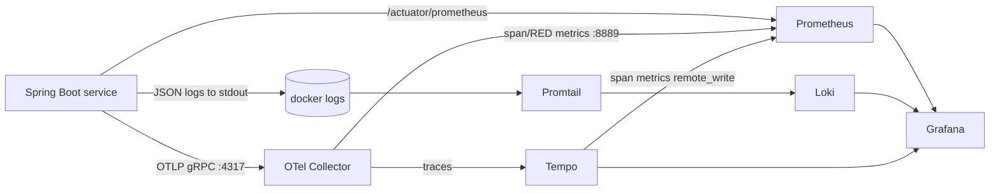

# Phase 2 — Infrastructure & Observability Setup

Everything needed to run the platform's **dependencies** locally with one command. Application microservices (Phases 4–11) attach to the same Docker network via [`services/docker-compose.apps.yml`](../services/docker-compose.apps.yml).

```bash
cd infra
cp .env.example .env          # dev-only defaults
docker compose up -d

# Then the application services (see the apps compose header for the
# one-time dev JWT keypair generation step):
docker compose -f ../services/docker-compose.apps.yml up -d --build
```

> **Prerequisite:** Docker Desktop (Engine 24+ with Compose v2). Not yet installed on this machine — install it before running.

---

## 1. What gets provisioned

| Component | Image | Host port(s) | Purpose |
|---|---|---|---|
| PostgreSQL | `postgres:16-alpine` | 5432 | One DB per service (auto-created) |
| Zookeeper | `cp-zookeeper:7.6.1` | — | Kafka coordination |
| Kafka | `cp-kafka:7.6.1` | 9092 | Event backbone |
| kafka-init | `cp-kafka:7.6.1` | — | One-shot topic creation |
| Kafka UI | `provectuslabs/kafka-ui` | 8090 | Topic/consumer inspection |
| Redis | `redis:7-alpine` | 6379 | Gateway rate limiting |
| OTel Collector | `otel/opentelemetry-collector-contrib:0.103.1` | 4317, 4318, 8889 | OTLP ingest → Tempo + Prom |
| Tempo | `grafana/tempo:2.5.0` | 3200 | Trace storage + span metrics |
| Loki | `grafana/loki:3.0.0` | 3100 | Log aggregation |
| Promtail | `grafana/promtail:3.0.0` | — | Ships container logs → Loki |
| Prometheus | `prom/prometheus:v2.53.0` | 9090 | Metrics scraping |
| Grafana | `grafana/grafana:11.1.0` | 3000 | Dashboards (Prom+Loki+Tempo) |

---

## 2. Access points

| UI | URL | Credentials |
|---|---|---|
| Grafana | http://localhost:3000 | `admin` / `admin` (`.env`) |
| Prometheus | http://localhost:9090 | — |
| Kafka UI | http://localhost:8090 | — |
| Tempo (via Grafana Explore) | http://localhost:3000/explore | — |
| Loki (via Grafana Explore) | http://localhost:3000/explore | — |

Grafana ships pre-provisioned with **3 datasources** (Prometheus, Loki, Tempo) and **2 dashboards** (Service Overview, Business & Kafka Metrics) under the *E-Commerce* folder.

---

## 3. The observability pipeline (how a request becomes signals)



**Correlation is the point:** a single `traceId` is stamped into metrics (exemplars), structured logs, and spans — so in Grafana you can jump **metric spike → trace → logs** for that exact request.

| Signal | Service-side (configured in Phase 4+) | Infra-side (this phase) |
|---|---|---|
| Metrics | Micrometer `/actuator/prometheus` | Prometheus scrape job `spring-services` |
| Logs | `logback-spring.xml` JSON to stdout | Promtail docker SD → Loki |
| Traces | OpenTelemetry SDK → `OTEL_EXPORTER_OTLP_ENDPOINT=http://otel-collector:4317` | Collector → Tempo |

---

## 4. Contracts the services must honor

When each microservice is built, it must (these are wired in their `application-docker.yml`):

```yaml
# Datasource (example: order-service)
spring.datasource.url: jdbc:postgresql://postgres:5432/order_db
spring.datasource.username: ${POSTGRES_USER}
spring.datasource.password: ${POSTGRES_PASSWORD}

# Kafka
spring.kafka.bootstrap-servers: kafka:29092

# Actuator (Prometheus scrape target)
management.endpoints.web.exposure.include: health,info,prometheus,metrics
management.metrics.tags.service: order-service     # becomes the `service` label

# Tracing (OTLP -> collector)
management.otlp.tracing.endpoint: http://otel-collector:4318/v1/traces
management.tracing.sampling.probability: 1.0       # 100% sampling for local
```

> **Network:** services join the external `ecommerce-net` network so DNS names (`postgres`, `kafka`, `otel-collector`) resolve.

---

## 5. Kafka topics created on startup

`kafka-init` creates (idempotently): `order.created`, `inventory.reserved`, `inventory.reservation-failed`, `inventory.released`, `payment.completed`, `payment.failed`, `order.confirmed`, plus `.DLT` dead-letter topics. Auto-topic-creation is **disabled** on the broker (explicit topology). Verify:

```bash
docker exec kafka kafka-topics --bootstrap-server kafka:29092 --list
```

---

## 6. Pre-built Grafana dashboards

| Dashboard | Panels |
|---|---|
| **Service Overview (RED + JVM)** | Throughput, p95 latency, error rate, JVM heap, CPU, committed memory — filterable by `service` |
| **Business & Kafka Metrics** | orders created/completed/failed, payments processed/failed, inventory reserved, **Kafka consumer lag** |

Custom business counters (`orders_created_total`, `payments_processed_total`, etc.) are registered via Micrometer in the respective services (Phases 8–9).

---

## 7. Operational commands

```bash
docker compose ps                       # status
docker compose logs -f otel-collector   # tail a component
docker compose down                     # stop (keep data)
docker compose down -v                  # stop + wipe volumes
curl -s localhost:9090/-/reload         # hot-reload Prometheus config
```

---

## 8. Notes & hardening (later)

- Single-binary Loki/Tempo with filesystem storage — fine for local; production uses object storage + horizontal scaling.
- Kafka replication factor = 1 locally; production uses RF=3 + `min.insync.replicas=2` (see [04-kafka-topic-design.md](04-kafka-topic-design.md)).
- `.env` holds dev-only secrets and is gitignored; production secrets come from Kubernetes Secrets (Phase 3).
- 100% trace sampling locally; production uses tail-based sampling at the collector.

---

## Phase 2 — Complete ✅

```
infra/
├── docker-compose.yml
├── .env.example
├── postgres/init-multiple-dbs.sh
├── prometheus/prometheus.yml
├── grafana/provisioning/datasources/datasources.yml
├── grafana/provisioning/dashboards/dashboards.yml
├── grafana/dashboards/{service-overview,business-metrics}.json
├── loki/loki-config.yml
├── promtail/promtail-config.yml
├── tempo/tempo.yml
└── otel/otel-collector-config.yml
```

**Next:** Phase 3 — Kubernetes manifests (namespace, Deployments/Services, ConfigMaps, Secrets, PVCs, NGINX Ingress) + Minikube setup.
