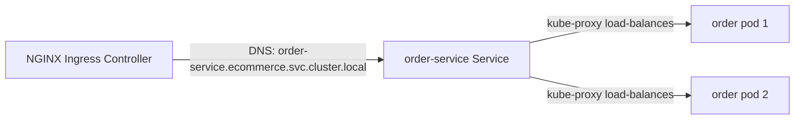

# Phase 3 — Kubernetes Manifests & Minikube Setup

All workloads run in the **`ecommerce`** namespace. Discovery is **pure Kubernetes DNS** — no Eureka, no Config Server. Configuration comes from ConfigMaps, secrets from Kubernetes Secrets.

> **Prerequisites (not yet installed on this machine):** Docker, `minikube`, `kubectl`.
> Install all three before deploying. See [§7](#7-installing-the-toolchain-windows).

---

## 1. Manifest inventory

```
k8s/
├── namespace.yaml                 # ecommerce namespace
├── secrets.yaml                   # postgres / jwt-keys / smtp / grafana
├── ingress.yaml                   # NGINX ingress (api + observability)
├── deploy.sh / deploy.ps1         # ordered, idempotent deploy
├── infra/
│   ├── postgres.yaml              # StatefulSet + PVC + init ConfigMap + headless Svc
│   ├── kafka.yaml                 # Zookeeper + Kafka StatefulSets + topic-init Job
│   ├── redis.yaml                 # gateway rate-limit store
│   ├── otel-collector.yaml        # ConfigMap + Deployment + Service
│   ├── tempo.yaml                 # ConfigMap + PVC + Deployment + Service
│   ├── loki.yaml                  # ConfigMap + PVC + Deployment + Service
│   ├── promtail.yaml              # DaemonSet + RBAC (ServiceAccount/ClusterRole)
│   ├── prometheus.yaml            # ConfigMap + PVC + Deployment + Service + RBAC
│   └── grafana.yaml               # datasources + dashboards + Deployment + Service
└── apps/
    ├── _common-config.yaml        # shared ConfigMap (kafka/otlp/actuator/jwt)
    ├── auth-service.yaml          # ConfigMap + Deployment + Service  (×7 services)
    ├── product-service.yaml
    ├── inventory-service.yaml
    ├── cart-service.yaml
    ├── order-service.yaml
    ├── payment-service.yaml
    └── notification-service.yaml
```

> The edge is the **NGINX Ingress Controller** (`minikube addons enable ingress`), configured by `k8s/ingress.yaml` + `k8s/ingress-nginx-config.yaml` — there is no `api-gateway` Deployment.

---

## 2. Production-grade defaults baked in

| Concern | Applied to every app |
|---|---|
| **Non-root** | `securityContext: runAsNonRoot, runAsUser: 1000, fsGroup: 1000` |
| **Probes** | `startupProbe` (slow JVM boot) + `readinessProbe` + `livenessProbe` on `/actuator/health/{readiness,liveness}` |
| **Resources** | `requests`/`limits` on CPU + memory |
| **Replicas** | 2 (HA) for stateless services; 1 for notification |
| **Metrics** | Pod annotations `prometheus.io/scrape,path,port` → auto-discovered |
| **Config** | `envFrom` shared `app-common-config` + per-service ConfigMap |
| **Secrets** | DB creds + JWT keys from Kubernetes Secrets (never in image) |
| **Discovery** | Feign/Kafka targets use K8s DNS names (`product-service:8082`, `kafka:9092`) |

---

## 3. Setup — exact commands

```bash
# 1. Start a cluster with enough resources
minikube start --cpus=4 --memory=8192 --driver=docker

# 2. Enable the NGINX ingress controller
minikube addons enable ingress

# 3. Build service images straight into Minikube's Docker daemon
#    (so imagePullPolicy: IfNotPresent finds them — no registry needed)
eval $(minikube docker-env)            # Windows PS: & minikube -p minikube docker-env | Invoke-Expression
#   ... from Phase 4+ each service: docker build -t ecommerce/<svc>:latest services/<svc>

# 4. Create the real JWT RS256 keypair secret (replaces placeholder)
openssl genrsa -out jwt-private.pem 2048
openssl rsa -in jwt-private.pem -pubout -out jwt-public.pem
kubectl create namespace ecommerce --dry-run=client -o yaml | kubectl apply -f -
kubectl -n ecommerce create secret generic jwt-keys \
  --from-file=private.pem=jwt-private.pem \
  --from-file=public.pem=jwt-public.pem \
  --dry-run=client -o yaml | kubectl apply -f -

# 5. Deploy everything (ordered)
./k8s/deploy.sh                        # Windows: .\k8s\deploy.ps1
#   ... or manually:
#   kubectl apply -f k8s/namespace.yaml
#   kubectl apply -f k8s/secrets.yaml -f k8s/apps/_common-config.yaml
#   kubectl apply -f k8s/infra/
#   kubectl apply -f k8s/apps/
#   # edge TLS cert (dev self-signed) + controller hardening, then routes:
#   openssl req -x509 -nodes -days 365 -newkey rsa:2048 -keyout tls.key -out tls.crt \
#     -subj "/CN=ecommerce.local/O=ecommerce" -addext "subjectAltName=DNS:ecommerce.local"
#   kubectl -n ecommerce create secret tls ecommerce-tls --cert=tls.crt --key=tls.key
#   kubectl apply -f k8s/ingress-nginx-config.yaml
#   kubectl apply -f k8s/ingress.yaml

# 6. Expose the ingress on localhost
minikube tunnel                        # keep running in a separate terminal
```

> `kubectl apply -f k8s/` is **non-recursive**. Use the provided `deploy.sh`/`deploy.ps1` (correct ordering + waits), or `kubectl apply -R -f k8s/`.

---

## 4. Host names → /etc/hosts

Add (Linux/macOS `/etc/hosts`, Windows `C:\Windows\System32\drivers\etc\hosts`):

```
127.0.0.1   ecommerce.local grafana.local prometheus.local
```
(Use `minikube ip` instead of 127.0.0.1 if not using `minikube tunnel`.)

| URL | Reaches |
|---|---|
| https://ecommerce.local/api/* | NGINX Ingress (API gateway) → all services (HTTP is redirected to HTTPS) |
| http://grafana.local | Grafana |
| http://prometheus.local | Prometheus |

---

## 5. Verify the rollout

```bash
kubectl -n ecommerce get pods -w
kubectl -n ecommerce get svc,ingress
kubectl -n ingress-nginx logs deploy/ingress-nginx-controller -f
kubectl -n ecommerce exec -it kafka-0 -- kafka-topics --bootstrap-server kafka:9092 --list
# Through the gateway (Ingress routes /api/*):
curl -k https://ecommerce.local/api/products
```

---

## 6. How discovery works (no Eureka)



- Each Deployment has a matching `Service` (ClusterIP). The Service name **is** the DNS hostname.
- Feign clients and Kafka bootstrap use those names directly (`http://product-service:8082`, `kafka:9092`).
- kube-proxy load-balances across pod replicas — replacing Ribbon.
- Resilience4j (in-service) replaces Hystrix for circuit breaking/retry.

---

## 7. Installing the toolchain (Windows)

```powershell
winget install -e --id Docker.DockerDesktop
winget install -e --id Kubernetes.minikube
winget install -e --id Kubernetes.kubectl
# then restart shell, ensure Docker Desktop is running, and re-run §3.
```

---

## 8. Teardown

```bash
kubectl delete namespace ecommerce      # removes everything in the namespace
minikube stop                           # or: minikube delete
```

---

## ⚠️ Validation status

This machine has **no Docker / kubectl / minikube / python**, so manifests could not be live-validated (`kubectl apply --dry-run=server`) or YAML-linted here. They are hand-authored to be apply-ready. **Before relying on them, run on a tooled machine:**

```bash
kubectl apply --dry-run=client -R -f k8s/      # client-side schema check
kubectl apply --dry-run=server -R -f k8s/      # server-side admission check (needs cluster)
```

---

## Phase 3 — Complete ✅

Namespace, Secrets, PostgreSQL (StatefulSet+PVC), Kafka+Zookeeper (+topic Job), Redis, full observability stack (Prometheus/Grafana/Loki/Promtail/Tempo/OTel with RBAC), all 8 app Deployments/Services/ConfigMaps, NGINX Ingress, and ordered deploy scripts.

**Next:** Phase 4 — Auth Service (complete production-ready code: registration, login, JWT RS256, refresh-token rotation, RBAC, Flyway, tests, Dockerfile, OpenAPI).
