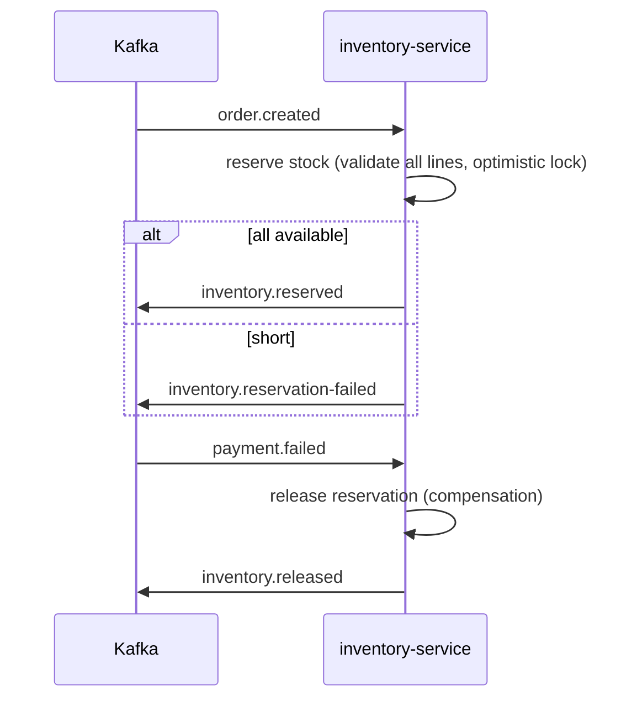

# Phase 6 — Inventory Service

The first **event-driven saga participant**. Manages stock, **reserves** on `order.created`, and **releases** (compensation) on `payment.failed`. Introduces the shared **`common-events`** module that all later event-driven services reuse.

---

## 1. Saga role



| Consumes | Produces |
|---|---|
| `order.created` | `inventory.reserved` / `inventory.reservation-failed` |
| `payment.failed` | `inventory.released` |

---

## 2. `common-events` shared module (`shared/common-events`)

Dependency-free contract module — `EventEnvelope<T>` (eventId, type, occurredAt, trace/correlation ids, payload), `Topics` constants, and payload records (`OrderCreatedEvent`, `InventoryReservedEvent`, `InventoryReservationFailedEvent`, `InventoryReleasedEvent`, `PaymentCompletedEvent`, `PaymentFailedEvent`, `OrderConfirmedEvent`). Registered in the parent `dependencyManagement`.

---

## 3. Correctness & resilience (the important bits)

| Concern | How |
|---|---|
| **No partial reservation** | All lines validated (`canReserve`) *before* any mutation; a shortfall returns `FAILED` with zero DB writes. |
| **Idempotency** | `processed_events` ledger keyed by `eventId`, recorded **in the same transaction** as the reservation — rollback un-records it so Kafka can safely redeliver. Plus a defensive `existsByOrderId` guard. |
| **Oversell prevention** | Optimistic locking (`@Version`) on `inventory_items`; concurrent conflict → rollback → redelivery. |
| **Commit-before-publish** | Service methods are `@Transactional` and return an outcome; the consumer publishes the result event only **after** the transaction commits — events never describe uncommitted state. |
| **Poison messages** | `DefaultErrorHandler` retries 3×/1s, then routes to `<topic>.DLT`; deserialization errors are non-retryable. |
| **Publisher resilience** | Full Resilience4j stack on the `kafka-publisher` — `@CircuitBreaker` + `@Retry` (exponential backoff) + `@RateLimiter` + `@Bulkhead` (20 concurrent). Rate-limiter / bulkhead rejections are in the breaker's `ignore-exceptions` so back-pressure never opens the circuit. |
| **Generic payloads** | `ByteArrayJsonMessageConverter` resolves `EventEnvelope<OrderCreatedEvent>` from the listener method signature (no raw-map erosion). |

**Business metrics:** `inventory_reserved_total`, `inventory_reservation_failed_total` (Micrometer → Prometheus).

---

## 4. REST API (resource server)

| Method | Path | Auth | Description |
|---|---|---|---|
| GET | `/api/inventory/{productId}` | authenticated | Stock levels (onHand/reserved/available) |
| PUT | `/api/inventory/{productId}` | **ADMIN** | Set on-hand + reorder level |
| POST | `/api/inventory/{productId}/receive` | **ADMIN** | Add stock |

---

## 5. Persistence (inventory_db)

`inventory_items` (unique `product_id`, `@Version`), `stock_reservations` (one row per order+product, status), `processed_events` (idempotency). Flyway `V1__init.sql`.

---

## 6. Tests

| Test | Type | Docker | Covers |
|---|---|---|---|
| `StockReservationServiceTest` | unit | no | reserve ok / insufficient / unknown / duplicate / already-reserved; release ok / nothing / duplicate |
| `InventoryServiceTest` | unit | no | get/upsert(new+existing)/receive |
| `InventorySagaIT` | integration | **yes** | publish `order.created` → reservation persisted + stock reserved (Testcontainers Postgres + Kafka) |

---

## 7. Verification status

**Verified on this machine (JDK 21, Maven 3.6.3):**

```
mvn -pl services/inventory-service -am test
...
[INFO] common-events ...................................... SUCCESS
[INFO] inventory-service .................................. SUCCESS
[INFO] Tests run: 13, Failures: 0, Errors: 0, Skipped: 0
[INFO] BUILD SUCCESS
```

- ✅ `common-events` + `inventory-service` compile on Java 21; all 13 unit tests pass (`StockReservationServiceTest` 8, `InventoryServiceTest` 5).
- ⏳ `InventorySagaIT` (Testcontainers Postgres + Kafka) **not run here** — needs Docker. Run `mvn -pl services/inventory-service -am verify`.

---

## Phase 6 — Inventory Service

Delivered: `common-events` module + inventory-service — stock management, choreographed reserve/release saga (idempotent, transactional, optimistic-locked), Kafka producer + DLT/retry consumers, Resilience4j, business metrics, resource-server security, Flyway, OpenAPI, JSON logging, multi-stage Dockerfile, unit + saga IT.

**Next:** Phase 7 — Cart Service (cart CRUD, **OpenFeign → product-service** with Resilience4j circuit breaker + fallback).
