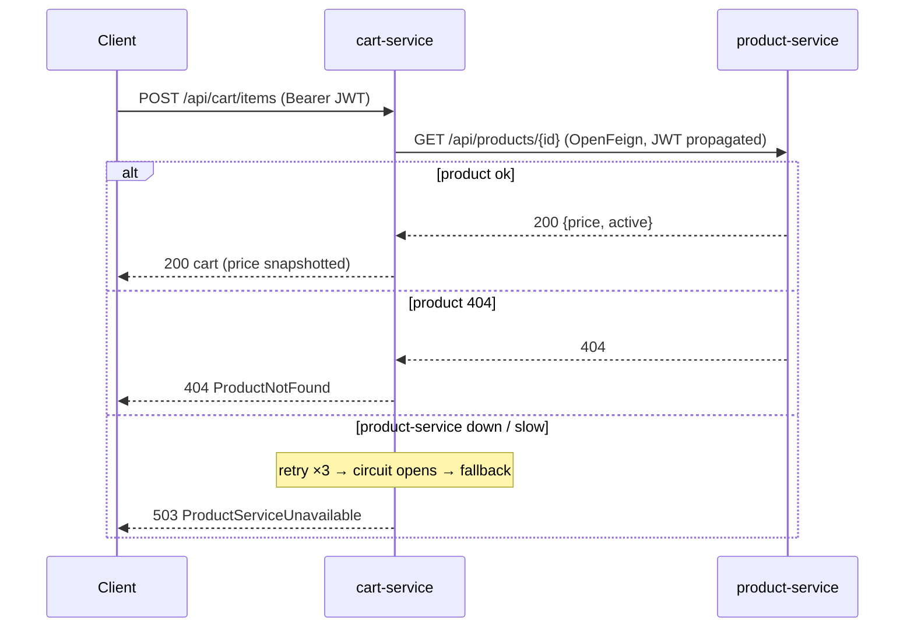

# Phase 7 — Cart Service

Per-user shopping cart. Introduces the first **synchronous inter-service call** — cart → product-service via **OpenFeign**, wrapped in the **full Resilience4j stack (retry + circuit breaker + rate limiter + bulkhead, with Feign-layer timeouts) and a graceful fallback**.

---

## 1. Endpoints (all authenticated; cart owner = JWT subject)

| Method | Path | Description |
|---|---|---|
| GET | `/api/cart` | View the current user's cart |
| POST | `/api/cart/items` | Add a product (validates + snapshots price) |
| PUT | `/api/cart/items/{productId}` | Update line quantity (`0` removes it) |
| DELETE | `/api/cart/items/{productId}` | Remove a product |
| DELETE | `/api/cart` | Empty the cart → `204` |

There is **no cross-user access**: the user id comes from the JWT `sub`, never from the request body/path.

---

## 2. Inter-service call + resilience (the focus of this phase)



| Aspect | Implementation |
|---|---|
| Discovery | **K8s DNS** via `@FeignClient(url=${PRODUCT_SERVICE_URL})` — no Eureka/Ribbon |
| Identity propagation | Feign `RequestInterceptor` forwards the caller's `Authorization` header |
| Retry | Resilience4j `@Retry` (3×, 300 ms) on transient/Feign errors; **404 not retried** |
| Circuit breaker | `@CircuitBreaker(name="product-service")` — opens at 50% failure over 10 calls |
| Rate limiter | `@RateLimiter(name="product-service")` — caps outbound calls (50 / s, fail-fast); rejection → fallback, not a circuit trip |
| Bulkhead | `@Bulkhead(name="product-service")` — caps concurrent in-flight calls (25) so a slow product-service can't exhaust request threads |
| Fallback | Converts an outage **or local back-pressure** into a clean **`503 ProductServiceUnavailable`**, never a stack trace |
| Timeout | Feign connect 2 s / read 3 s (timeouts stay at the Feign layer — no async `@TimeLimiter`) |
| Degradation | **Viewing** the cart never calls product-service (uses snapshot prices) — read path stays up even if product-service is down |

A `404` is treated as a normal "absent" answer (returns empty, no circuit trip); only real failures count toward the breaker. Likewise, rate-limiter (`RequestNotPermitted`) and bulkhead (`BulkheadFullException`) rejections are listed under the breaker's `ignore-exceptions` — local back-pressure is not a downstream fault and must not open the circuit.

---

## 3. Domain & persistence

- `Cart` (immutable aggregate; adding an existing product increments quantity; `unitPrice` snapshotted at add time), `CartItem`.
- `cart_db`: `carts` (one per user) + `cart_items` (JPA `@ElementCollection`). Flyway `V1__init.sql`.

---

## 4. Tests

| Test | Type | Docker | Covers |
|---|---|---|---|
| `CartServiceTest` | unit | no | add (ok/not-found/inactive/**downstream-503**/increment), update (set/zero-removes/missing), remove, clear, empty-get |
| `CartFlowIT` | integration | **yes** | add→view with mocked catalog port + minted JWT; **401** without token (Testcontainers Postgres) |

---

## 5. Verification status

**Verified on this machine (JDK 21, Maven 3.6.3):**

```
mvn -pl services/cart-service -am test
...
[INFO] Compiling 28 source files with javac [debug parameters release 21]
[INFO] Tests run: 11, Failures: 0, Errors: 0, Skipped: 0
[INFO] BUILD SUCCESS
```

- ✅ Compiles on Java 21; all 11 unit tests pass (`CartServiceTest`), including the **downstream-unavailable → 503** propagation.
- ⏳ `CartFlowIT` (Testcontainers Postgres + mocked catalog port + minted JWT) **not run here** — needs Docker. Run `mvn -pl services/cart-service -am verify`.

---

## Phase 7 — Cart Service

Delivered: cart CRUD, OpenFeign client to product-service with **Resilience4j circuit breaker + retry + rate limiter + bulkhead + fallback** (timeouts at the Feign layer) and JWT propagation, resource-server security, Flyway, OpenAPI, JSON logging, multi-stage Dockerfile, unit + integration tests.

**Next:** Phase 8 — Order Service (the **saga initiator**: snapshots the cart via Feign, persists the order, publishes `order.created`, and consumes `payment.*`/`inventory.reservation-failed` to drive order status + emit `order.confirmed`). Custom metrics `orders_created/completed/failed_total`.
