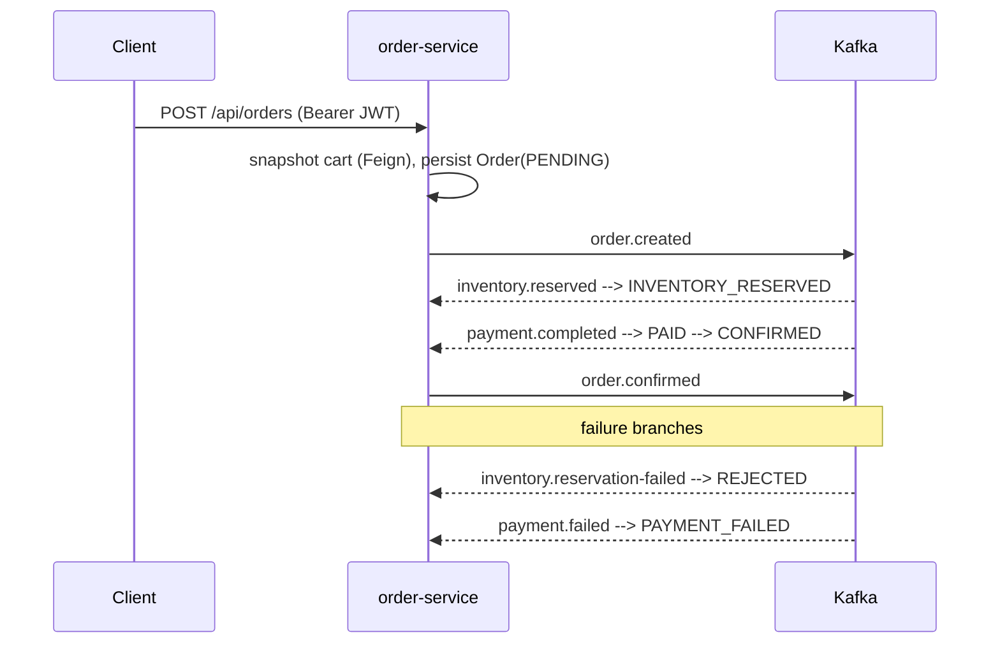

# Phase 8 — Order Service

The **saga initiator** and the keystone that ties Phases 6–7 together. Places orders (snapshotting the cart via Feign), publishes `order.created`, then consumes inventory + payment events to drive the order through its lifecycle — emitting `order.confirmed` on success.

---

## 1. The choreographed saga (order-service's view)



**Status machine** (`OrderStatus.canTransitionTo`):

```
PENDING ──▶ INVENTORY_RESERVED ──▶ PAID ──▶ CONFIRMED
   │                │
   └──▶ REJECTED    └──▶ PAYMENT_FAILED       (terminal: CONFIRMED/REJECTED/PAYMENT_FAILED/CANCELLED)
```

Transitions are **lenient about cross-topic ordering** (PAID may arrive from PENDING if `inventory.reserved` hasn't been processed yet) but never resurrect a terminal order — illegal transitions are logged and skipped, not failed.

| Consumes | Effect | Produces |
|---|---|---|
| `inventory.reserved` | → INVENTORY_RESERVED | — |
| `inventory.reservation-failed` | → REJECTED (`orders_failed_total`) | — |
| `payment.completed` | → PAID → CONFIRMED (`orders_completed_total`) | `order.confirmed` |
| `payment.failed` | → PAYMENT_FAILED (`orders_failed_total`) | — |

---

## 2. Endpoints (authenticated)

| Method | Path | Description |
|---|---|---|
| POST | `/api/orders` | Place order from the caller's cart → `201` |
| GET | `/api/orders` | Order history (own) |
| GET | `/api/orders/{id}` | Get order (owner or ADMIN; non-owners get `404`) |
| GET | `/api/orders/{id}/status` | Lightweight status check |

---

## 3. Correctness properties

| Concern | How |
|---|---|
| **Persist-before-publish** | `createPending` commits in the repo adapter; `order.created` is published only after |
| **Idempotency** | `processed_events` ledger keyed by `eventId`, written in the **same transaction** as the status change |
| **Commit-before-publish (confirm)** | saga handler is `@Transactional` and returns the order; the consumer publishes `order.confirmed` post-commit |
| **Cart resilience** | Feign call to cart-service wrapped in the full Resilience4j stack — retry + circuit breaker + rate limiter + bulkhead (timeouts at the Feign layer); outage or local back-pressure → `503`, not a broken order. The `kafka-publisher` carries the same CB + retry + rate limiter + bulkhead. |
| **Cart clear** | best-effort after placement (failure logged, order still placed) |
| **Status history** | every transition appends an `order_status_history` row |
| **Business metrics** | `orders_created_total`, `orders_completed_total`, `orders_failed_total` |

---

## 4. Persistence (order_db)

`orders` (`@Version` optimistic lock), `order_items`, `order_status_history`, `processed_events`. Flyway `V1__init.sql`.

> Note: cart snapshots carry `productId/quantity/unitPrice`; order currency uses a configurable `order.default-currency` (USD) since the cart contract doesn't expose per-line currency. Flagged for a future cart-contract enrichment.

---

## 5. Tests

| Test | Type | Docker | Covers |
|---|---|---|---|
| `OrderServiceTest` | unit | no | placeOrder (empty/happy/**cart-down 503**/clear-fails), ownership hiding, admin access |
| `OrderSagaServiceTest` | unit | no | confirm (+count), duplicate, terminal-skip, payment-failed, rejection, inventory-reserved |
| `OrderPlacementIT` | integration | **yes** | POST → 201 + history (Testcontainers Postgres + Kafka, mocked cart); 401 |

---

## 6. Verification status

**Verified on this machine (JDK 21, Maven 3.6.3):**

```
mvn -pl services/order-service -am test
...
[INFO] Compiling 42 source files with javac [debug parameters release 21]
[INFO] Tests run: 13, Failures: 0, Errors: 0, Skipped: 0
[INFO] BUILD SUCCESS
```

- ✅ Compiles on Java 21; all 13 unit tests pass (`OrderSagaServiceTest` 7, `OrderServiceTest` 6) — incl. terminal-skip, confirm-and-count, and cart-clear-failure-still-places.
- ⏳ `OrderPlacementIT` (Testcontainers Postgres + Kafka) **not run here** — needs Docker. Run `mvn -pl services/order-service -am verify`.

---

## Phase 8 — Order Service

Delivered: order lifecycle + saga initiator — cart snapshot via resilient Feign, `order.created` producer, inventory/payment saga consumers with idempotency + DLT, status machine + history, `order.confirmed` emission, business metrics, resource-server security, Flyway, OpenAPI, JSON logging, multi-stage Dockerfile, unit + integration tests.

**Next:** Phase 9 — Payment Service (consumes `inventory.reserved`, simulates payment, emits `payment.completed`/`payment.failed`; metrics `payments_processed_total`, `payment_failures_total`).
