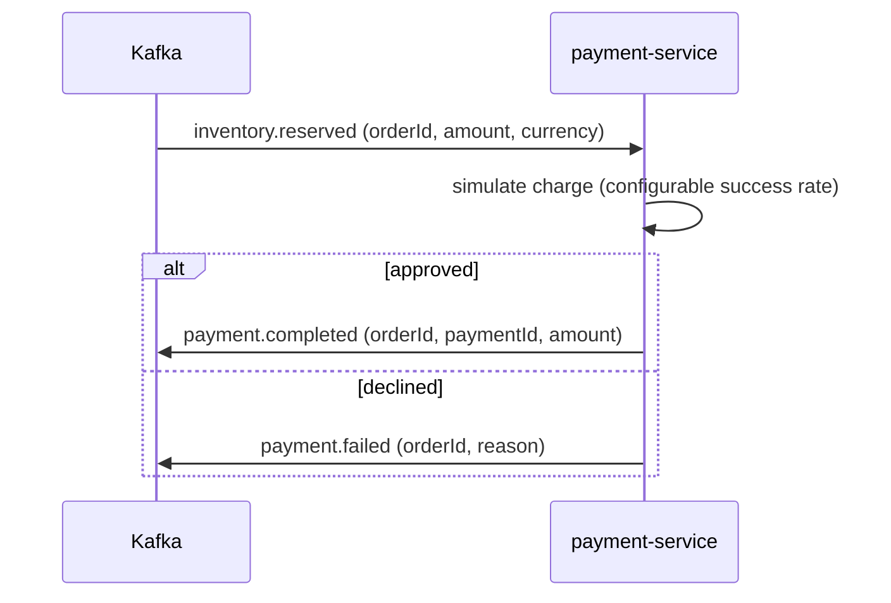

# Phase 9 — Payment Service

Closes the saga loop. Consumes `inventory.reserved`, simulates payment, and emits `payment.completed` / `payment.failed` — the events order-service consumes to confirm or fail the order.

---

## 1. Saga role



| Consumes | Produces |
|---|---|
| `inventory.reserved` | `payment.completed` / `payment.failed` |

**Event contract change:** `inventory.reserved` now carries `amount` + `currency` (sourced from `order.created` and forwarded by inventory-service) so payment can charge **without an extra lookup** — keeping the service fully decoupled.

---

## 2. Design

| Aspect | Implementation |
|---|---|
| Payment processor | `PaymentGatewayPort` abstraction; `SimulatedPaymentGateway` approves a configurable fraction (`payment.success-rate`), declines invalid amounts. Swap for a real PSP without touching the application layer. |
| Idempotency | `processed_events` ledger (by `eventId`) **+** unique `order_id` on `payments`, both committed in the same transaction as the charge |
| Commit-before-publish | service returns an outcome; the consumer publishes `payment.completed`/`failed` post-commit |
| Persistence | every attempt persisted (`INITIATED → COMPLETED | FAILED`) with failure reason |
| Resilience / DLT | Full Resilience4j stack on the `kafka-publisher` (circuit breaker + retry + rate limiter + bulkhead; back-pressure ignored by the breaker); `DefaultErrorHandler` + `<topic>.DLT` + retry on the consumer |
| Metrics | `payments_processed_total`, `payment_failures_total` |

---

## 3. API (resource server)

| Method | Path | Auth | Description |
|---|---|---|---|
| GET | `/api/payments/{orderId}` | authenticated | Payment status for an order |

---

## 4. Persistence (payment_db)

`payments` (unique `order_id`, status, amount, failure_reason) + `processed_events`. Flyway `V1__init.sql`.

---

## 5. Tests

| Test | Type | Docker | Covers |
|---|---|---|---|
| `PaymentServiceTest` | unit | no | approved (+count), declined (+count), duplicate event, existing payment, status lookup (found/404) |
| `PaymentSagaIT` | integration | **yes** | publish `inventory.reserved` → COMPLETED payment persisted (Testcontainers Postgres + Kafka) |

---

## 6. Verification status

**Verified on this machine (JDK 21, Maven 3.6.3):**

```
mvn -pl services/payment-service -am test     → Tests run: 6,  Failures: 0  → BUILD SUCCESS
mvn -pl services/inventory-service -am test   → Tests run: 13, Failures: 0  → BUILD SUCCESS (regression for enriched event)
```

- ✅ payment-service compiles on Java 21; all 6 unit tests pass (approved/declined/duplicate/existing/lookup).
- ✅ inventory-service regression green after the `inventory.reserved` contract change.
- 🐞 First build failed: a record static factory `approved()` collided with the `approved` component accessor — renamed to `approve()`/`decline()`.
- ⏳ `PaymentSagaIT` (Testcontainers Postgres + Kafka) **not run here** — needs Docker. Run `mvn -pl services/payment-service -am verify`.

---

## Phase 9 — Payment Service

Delivered: payment simulation + saga participant — `inventory.reserved` consumer, `payment.completed`/`payment.failed` producer with DLT/retry, pluggable gateway port, idempotency, business metrics, resource-server status API, Flyway, OpenAPI, JSON logging, multi-stage Dockerfile, unit + saga IT. Also enriched the `inventory.reserved` contract with amount/currency.

**Next:** Phase 10 — Notification Service (consumes `order.confirmed` + `payment.completed`, sends email notifications, persists an audit log).
