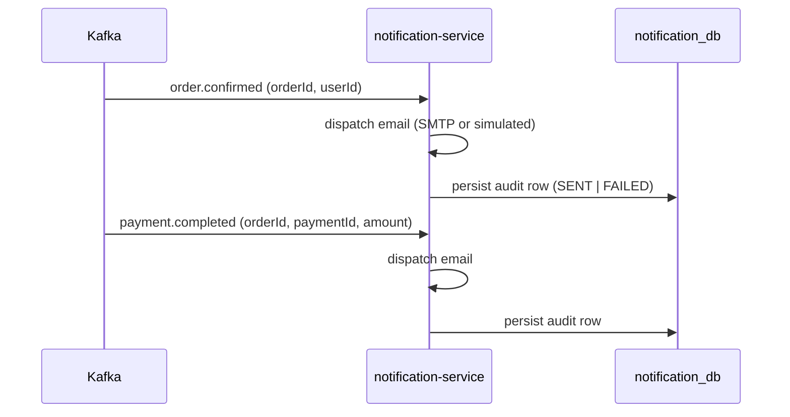

# Phase 10 — Notification Service

The terminal saga consumer. Listens to `order.confirmed` and `payment.completed`, sends an email per event, and persists an audit record. Pure Kafka consumer — **no producer, no outbound REST/Feign**.

---

## 1. Saga role



| Consumes | Produces |
|---|---|
| `order.confirmed`, `payment.completed` | — (terminal consumer) |

A single order produces **two** notifications (one per event type); they are distinct rows keyed by `(reference_id, type)`.

---

## 2. Design

| Aspect | Implementation |
|---|---|
| Email dispatch | `NotificationSenderPort` abstraction. Default `LoggingNotificationSender` (simulated, always succeeds) keeps local/dev/test free of an SMTP dependency. `SmtpNotificationSender` (active when `notification.mail.enabled=true`) sends via Spring's `JavaMailSender`; delivery errors are caught and reported as a FAILED result, never thrown. |
| Idempotency | `processed_events` ledger (by `eventId`) **+** unique `(reference_id, type)` on `notifications`, both committed in the same transaction as the send |
| Recipient | Synthesized from the event (`user-<userId>@example.com` / `order-<orderId>@example.com`) — this service does no user-profile lookup, preserving the no-cross-service-call constraint |
| Persistence | every notification persisted as `PENDING → SENT | FAILED` with `failure_reason` + `sent_at` |
| DLT | `DefaultErrorHandler` + `<topic>.DLT` + `FixedBackOff` retry; deserialization errors are not retried |
| Security | Resource server (RS256 JWT) guarding the read endpoint; actuator/docs public |
| Metrics | `notifications_sent_total`, `notifications_failed_total` |

### Clean Architecture layers

```
api            NotificationController, DTOs, GlobalExceptionHandler
application    RecordNotificationUseCase / NotificationQueryUseCase, NotificationService, ports
domain         Notification aggregate, NotificationStatus/Type/Channel, exception (zero framework deps)
infrastructure persistence (JPA adapters + processed_events), messaging (consumer + KafkaConfig),
               email (Logging/Smtp senders), security, config (OpenAPI)
```

---

## 3. Database (`notification_db`)

| Table | Purpose |
|---|---|
| `notifications` | audit log: `id, reference_id, channel, recipient, type, status, payload, failure_reason, created_at, sent_at`; unique `(reference_id, type)`; index on `reference_id` |
| `processed_events` | idempotency ledger keyed by `event_id` |

Flyway `V1__init.sql`, forward-only.

---

## 4. API

| Method | Path | Auth | Description |
|---|---|---|---|
| GET | `/api/notifications/{referenceId}` | Bearer JWT | List notifications raised for a reference (order id), oldest first |

Returns an empty list when none exist (audit query, not a 404).

---

## 5. Configuration

| Property | Default | Notes |
|---|---|---|
| `notification.mail.enabled` | `false` | `true` → real SMTP via `SmtpNotificationSender` |
| `notification.mail.from` | `no-reply@ecommerce.local` | sender address |
| `spring.mail.*` | — | host/port/credentials (k8s: from `smtp-credentials` secret) |
| `SERVER_PORT` | `8087` | |
| `SPRING_KAFKA_CONSUMER_GROUP_ID` | `notification-service` | |

Profiles: `local` (localhost), `docker` (compose DNS), `k8s` (env from ConfigMap/Secret). K8s manifest: `k8s/apps/notification-service.yaml`.

---

## 6. Verification

> Docker is not available on the build host, so the Testcontainers IT is deferred. Unit tests run on JDK 21.

```powershell
$env:JAVA_HOME="C:\Program Files\OpenLogic\jdk-21.0.8.9-hotspot"
cd d:\MyDevWorkSpace\JS\ecommerce-platform
mvn -B -pl services/notification-service -am test
```

Unit coverage:
- `NotificationServiceTest` — delivered→SENT+counter, failure→FAILED+counter, duplicate event skipped, duplicate `(reference,type)` skipped, audit query.
- `NotificationEventsConsumerTest` — both listeners build the correct command (reference, type, recipient, message).
- `SmtpNotificationSenderTest` — success builds the expected `SimpleMailMessage`; `MailException` is caught and reported as failure.
- `LoggingNotificationSenderTest` — simulated sender reports success.

End-to-end (once infra is up): place an order → after `order.confirmed` + `payment.completed`, two rows appear under `GET /api/notifications/{orderId}`.
