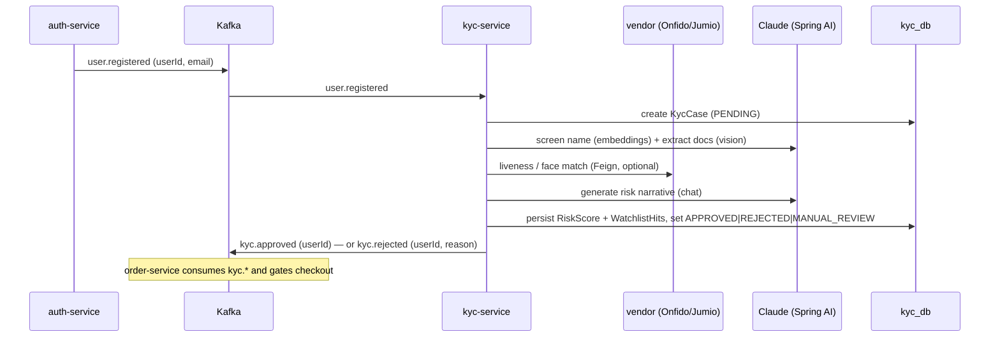

# Phase 14 — KYC / Compliance Service

> **Status: DESIGN.** New service beyond the original 13-phase plan. Implement only after Phase 13 (CI/CD) is delivered. This doc is the source of truth — read it before scaffolding code.

A new bounded context that gates a customer's ability to transact until identity verification and sanctions screening pass. This is the **first service in the platform that genuinely benefits from an LLM** — and the place where Spring AI earns its dependency. Everything else in the platform (auth, saga, gateway, resilience) is deliberately *not* AI-shaped.

---

## 1. Why an LLM here (and where it does NOT help)

| KYC capability | Approach | LLM? |
|---|---|---|
| **Sanctions / watchlist name screening** | Embedding-based fuzzy match of customer name+aliases against an embedded OFAC/UN/EU watchlist in pgvector. Beats Levenshtein on transliteration variants ("Mohammed Al-Rashid" vs "Muhammad Alrasheed"). | **Embeddings** (see §2 — *not* Claude) |
| **ID document data extraction** | Multimodal model reads an uploaded passport / national ID image → structured fields (name, DOB, doc number, expiry, nationality). | **Claude (vision)** |
| **Risk narrative / SAR draft** | LLM turns structured risk signals (country risk, PEP hit, velocity) into a human-readable explanation for a compliance officer. | **Claude (chat)** |
| **Compliance Q&A (internal)** | RAG over AML policy / GDPR / FATF docs embedded in pgvector. | **Claude (chat) + embeddings** |
| Liveness / face match | Specialist vendor (Onfido / Jumio / Sumsub) via Feign. | ❌ no LLM |
| Transaction rules / thresholds | Deterministic rules engine (in-service or Drools). | ❌ no LLM |
| OFAC/UN list ingestion | Scheduled feed parser → DB + vector store. | ❌ no LLM |

**Bottom line:** Spring AI is the right tool for screening, extraction, and narratives. It does **not** replace a specialist identity-verification vendor for liveness/biometrics — that stays a Feign adapter.

---

## 2. Critical constraint — Anthropic has no embeddings API

Claude is **chat + vision only**. Anthropic does not expose an embeddings endpoint, so the sanctions-screening vectors and the RAG index **cannot** come from Claude. Spring AI's `EmbeddingModel` is provider-agnostic — wire it to one of:

| Embedding provider | Spring AI starter | Notes |
|---|---|---|
| **Voyage AI** (recommended) | `spring-ai-voyageai` *(or REST adapter)* | Anthropic's recommended embeddings partner; strong on multilingual/name matching |
| Local / ONNX (Transformers) | `spring-ai-transformers` | No external call, no per-token cost, runs in-pod; fits the "no avoidable external dependency" instinct of this platform |
| OpenAI embeddings | `spring-ai-openai` | Only if an OpenAI key is already in play |

So the service uses **two** model beans: a Claude `ChatModel` (chat + multimodal) and a separate `EmbeddingModel`. Keep them behind ports so the embedding provider is swappable without touching domain/application code.

> Per `claude-api` guidance, default the chat model to the latest Claude: `spring.ai.anthropic.chat.options.model=claude-opus-4-8`. Document extraction and narrative generation are quality-sensitive — do not silently downgrade.

---

## 3. Saga role



| Consumes | Produces |
|---|---|
| `user.registered` | `kyc.approved`, `kyc.rejected` |

`MANUAL_REVIEW` is a terminal-until-officer state — no event published until an officer resolves it via the API (which then emits `kyc.approved`/`kyc.rejected`).

> **Cross-service impact (Phase 14b, separate change):** order-service must consume `kyc.*` and refuse `placeOrder` for un-approved users. That is a modification to an existing service and saga — design it as its own follow-up, not bundled here. Until then, KYC runs in **observe-only** mode (screens + records, gates nothing).

---

## 4. Design

| Aspect | Implementation |
|---|---|
| AI access | Spring AI. `ScreeningPort` → `EmbeddingModel` + pgvector `VectorStore`; `DocumentExtractionPort` / `RiskNarrativePort` → Claude `ChatClient`. Domain has **zero** Spring AI types — all behind application ports. |
| Resilience | Spring AI calls are **outbound network calls** → wrap every AI adapter in Resilience4j `@CircuitBreaker` + `@Retry` + `@RateLimiter` + `@Bulkhead`, exactly like the Feign adapters (see OpenFeign pattern). LLM latency/cost makes the rate limiter + bulkhead load-bearing here. |
| Vendor calls | `IdentityVendorPort` → `@FeignClient` (Onfido/Jumio), K8s DNS / external URL, same resilient-adapter pattern. Optional — gated by `kyc.vendor.enabled` (default `false`, simulated adapter in local/dev/test so no vendor key needed). |
| Idempotency | `processed_events` ledger (by `eventId`) + unique `(user_id)` on `kyc_cases`, same transaction as the state change |
| Persistence | `KycCase` (PENDING → IN_PROGRESS → APPROVED / REJECTED / MANUAL_REVIEW), `RiskScore`, `WatchlistHit`; documents stored as references, **never raw PII images in the row** |
| Watchlist data | Scheduled ingestion job parses OFAC SDN / UN feeds → `watchlist_entries` + embedded vectors in pgvector. Local/dev seeds a tiny fixture list. |
| DLT | `DefaultErrorHandler` + `<topic>.DLT` + `FixedBackOff`; deserialization errors not retried |
| Security | Resource server (RS256 JWT). Officer endpoints require `ROLE_COMPLIANCE`; self-status read requires the owning user. Actuator/docs public. |
| Metrics | `kyc_cases_total{status}`, `kyc_watchlist_hits_total`, `kyc_ai_calls_total{op}`, `kyc_ai_call_latency` |
| PII / data protection | Audit every AI call (op, model, case id — **not** the document bytes). Honour GDPR erasure: a delete path redacts extracted fields and document refs while preserving the audit trail. No secrets/PII in prompts that get logged. |

### Clean Architecture layers

```
api            KycController (officer + self), DTOs, GlobalExceptionHandler
application     ScreenCustomerUseCase, ExtractDocumentUseCase, GenerateRiskNarrativeUseCase,
               ResolveCaseUseCase, KycQueryUseCase, KycService, ports
domain          KycCase aggregate, RiskScore, WatchlistHit, KycStatus, exceptions (zero framework deps)
infrastructure  persistence (JPA + pgvector + processed_events), messaging (consumer + publisher + KafkaConfig),
                ai (Spring AI adapters: screening / extraction / narrative, all Resilience4j-wrapped),
                vendor (Feign identity adapter), security, config (OpenAPI, AiConfig, VectorStoreConfig)
```

---

## 5. Database (`kyc_db`)

| Table | Purpose |
|---|---|
| `kyc_cases` | `id, user_id (unique), status, risk_score, decision_reason, created_at, updated_at, resolved_by` |
| `watchlist_hits` | matches for a case: `id, case_id, list_source, matched_name, score, payload` |
| `watchlist_entries` | ingested OFAC/UN/EU rows + embedding vector column (pgvector) |
| `kyc_documents` | document **references** + extracted fields (no raw image bytes); redactable for GDPR |
| `processed_events` | idempotency ledger keyed by `event_id` |

Requires the **pgvector** extension. Flyway `V1__init.sql` (`CREATE EXTENSION IF NOT EXISTS vector;` + tables), forward-only. Spring AI's pgvector `VectorStore` can own its own table or reuse `watchlist_entries`.

---

## 6. API

| Method | Path | Auth | Description |
|---|---|---|---|
| GET | `/api/kyc/me` | Bearer JWT (owner) | Caller's own KYC status |
| GET | `/api/kyc/{userId}` | `ROLE_COMPLIANCE` | Case detail incl. hits + narrative |
| GET | `/api/kyc/cases?status=MANUAL_REVIEW` | `ROLE_COMPLIANCE` | Review queue (paginated) |
| POST | `/api/kyc/{userId}/resolve` | `ROLE_COMPLIANCE` | Officer decision → emits `kyc.approved`/`kyc.rejected` |
| POST | `/api/kyc/{userId}/documents` | Bearer JWT (owner) | Upload an ID document → triggers extraction |

---

## 7. Configuration

| Property | Default | Notes |
|---|---|---|
| `spring.ai.anthropic.api-key` | — | from K8s Secret `anthropic-credentials` / env `ANTHROPIC_API_KEY` |
| `spring.ai.anthropic.chat.options.model` | `claude-opus-4-8` | latest Claude; quality-sensitive |
| `kyc.embedding.provider` | `transformers` | `transformers` (local) \| `voyage` \| `openai` |
| `kyc.vendor.enabled` | `false` | `true` → real Onfido/Jumio via Feign; else simulated |
| `kyc.gating.enabled` | `false` | observe-only until Phase 14b wires order-service |
| `SERVER_PORT` | `8088` | next free port (auth 8081 … notification 8087) |
| `SPRING_KAFKA_CONSUMER_GROUP_ID` | `kyc-service` | |

Profiles: `local` (localhost, simulated vendor + local embeddings + a dummy/echo chat model so no API key is needed to run tests), `docker` (compose DNS), `k8s` (env from ConfigMap/Secret). New manifest: `k8s/apps/kyc-service.yaml`; topics added to both `k8s` kafka topic Job and `infra` compose kafka-init (`user.registered` already exists from auth; add `kyc.approved`, `kyc.rejected` + their `.DLT`).

> **Test/local must not require a real Anthropic key.** Provide a `local`-profile stub `ChatModel`/`EmbeddingModel` (deterministic fake) behind the same ports, so unit tests and `mvn test` run offline — mirrors how `LoggingNotificationSender` keeps notification-service test-free of SMTP.

---

## 8. New dependencies

| Dependency | Why |
|---|---|
| `spring-ai-anthropic-spring-boot-starter` | Claude chat + vision |
| `spring-ai-pgvector-store-spring-boot-starter` | vector store on the existing Postgres |
| one embedding starter (`spring-ai-transformers` default) | embeddings (Anthropic has none) |
| `spring-cloud-starter-openfeign` + `resilience4j` | vendor adapter (already platform-standard) |

Add a Spring AI BOM to the parent pom alongside the Spring Boot / Spring Cloud BOMs. Keep these deps **only** in the kyc-service module — do not pollute the shared modules or other services.

---

## 9. Verification (planned)

> Docker may be unavailable on the build host → Testcontainers IT deferred; unit tests run on JDK 21 with the stub AI models.

```powershell
$env:JAVA_HOME="C:\Program Files\Microsoft\jdk-21.0.11.10-hotspot"
cd d:\MyDevWorkSpace\JS\ecommerce-platform
mvn -B -pl services/kyc-service -am test
```

Unit coverage to target:
- `KycServiceTest` — user.registered → case PENDING; clean screen → APPROVED + event; watchlist hit → MANUAL_REVIEW (no event); officer resolve → event; duplicate event skipped.
- AI adapter tests — each Spring AI adapter maps the stub model output to domain types; Resilience4j fallback returns a safe default (fail **closed**: AI failure → MANUAL_REVIEW, never auto-approve).
- `ScreeningAdapterTest` — embedding similarity above threshold yields a `WatchlistHit`.
- Saga IT (Testcontainers, Postgres+Kafka, deferred) — publish `user.registered` → assert a `kyc_cases` row + `kyc.approved` published.

End-to-end (infra up): register a user → KYC case auto-created → `GET /api/kyc/me` shows status; a fixture-matched name lands in the `MANUAL_REVIEW` queue.

---

## 10. Open decisions (confirm before implementing)

1. **Embedding provider** — local Transformers (offline, free, fits platform ethos) vs Voyage AI (best accuracy, external key). Default in this doc: local Transformers.
2. **Gating** — keep observe-only this phase, or include the order-service `kyc.*` gate now (Phase 14b)?
3. **Vendor** — stub-only this phase, or wire a real Onfido/Jumio sandbox?
4. **Fail-open vs fail-closed** on AI/vendor outage — this doc assumes **fail-closed** (→ MANUAL_REVIEW).
