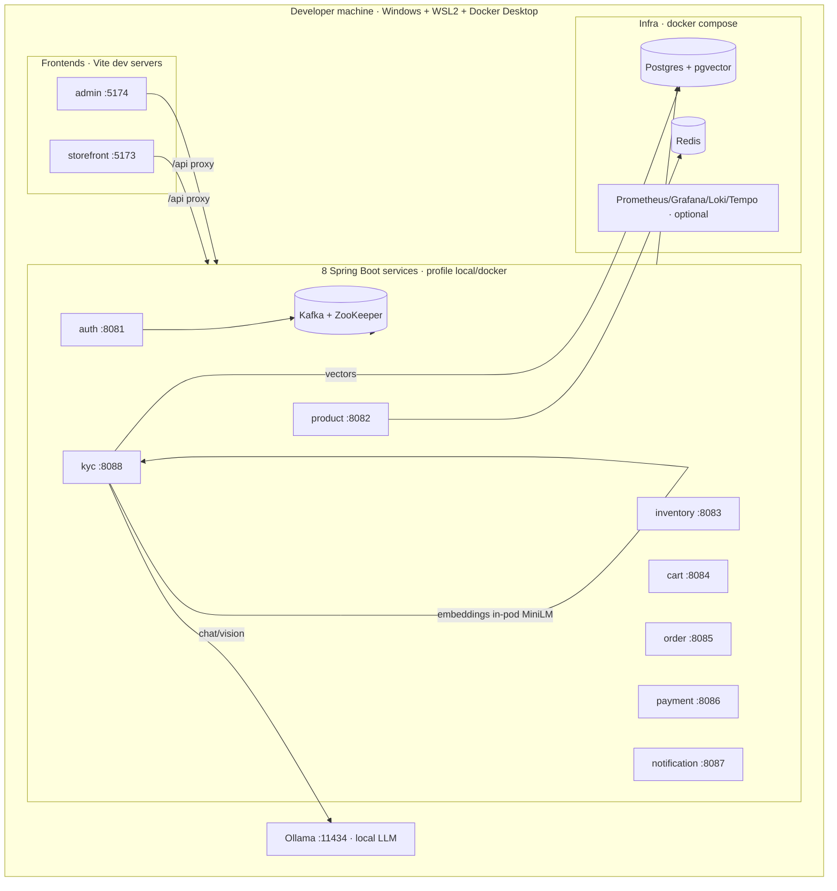

# 20 — Local Setup & AI Roadmap

> **This is a local-only project. There is no CI/CD.** The original plan's Phase 13 (GitHub Actions → SonarQube → docker push) is **dropped**. Everything runs on a single developer machine via Docker Compose (or Minikube). Code quality / security scanning that would have lived in CI runs **locally on demand** instead (see §4).

This doc covers: the local technical architecture, how to run the whole platform — including the Spring AI features — **for free** with Ollama, the concrete Spring AI next steps, and the free-tool stack.

---

## 1. Local technical architecture



**Key points for local:**
- **No NGINX ingress locally.** The Vite dev proxy fans `/api/<ctx>` to `localhost:8081-8088` (or set `VITE_API_PROXY_TARGET`). The ingress is a k8s/prod concern only.
- **Each service** runs either as a `java -jar target/<svc>.jar --spring.profiles.active=local` JVM **or** as a container via `services/docker-compose.apps.yml` (profile `docker`).
- **Spring AI in kyc-service** is the only AI consumer:
  - **chat + vision** → an LLM (Claude *or* local Ollama — §2),
  - **embeddings** → in-pod local Transformers (`all-MiniLM-L6-v2`, 384-dim) — already free, no external call,
  - **vectors** → pgvector on the shared Postgres.
- **Profiles:** `local` (localhost + Ollama or stubs), `docker` (compose DNS + `ollama` service), and an optional `cloud` (real Claude API). Stub `ChatModel`/`EmbeddingModel` keep `mvn test` fully offline.

---

## 2. Run the Spring AI features for free — Ollama

The kyc-service uses Claude (`claude-opus-4-8`) by default, which needs a **paid** `ANTHROPIC_API_KEY`. For a local/learning project you don't need that — swap the chat/vision model for a **local LLM via [Ollama](https://ollama.com)** (free, offline). Because the kyc adapters sit behind ports and use Spring AI's `ChatModel` abstraction, **this is a config + dependency change, not a code rewrite.**

### Install Ollama (Windows) — ✅ done 2026-06-15

Installed via winget (per-user, no admin needed). Ollama runs as a background service on `http://localhost:11434` and auto-starts on login.

```powershell
# 1. Install (per-user; no UAC prompt)
winget install --id Ollama.Ollama -e --accept-package-agreements --accept-source-agreements

# 2. New shell picks up PATH; verify the binary + the service
ollama --version                              # e.g. "ollama version is 0.30.6"
#   binary: %LOCALAPPDATA%\Programs\Ollama\ollama.exe
curl http://localhost:11434/api/version       # -> {"version":"0.30.6"}  (service auto-started)

# 3. Pull the models sized for this host (see §5 for RAM)
ollama pull llama3.2:3b        # chat / risk narratives  (~2 GB)
ollama pull llava:7b           # ID-document vision      (~4.5 GB) — only if testing extraction

# 4. Confirm + smoke-test
ollama list                                   # shows the pulled models
ollama run llama3.2:3b "say hello in 3 words" # quick sanity check
```

> If `ollama` isn't found in a fresh shell, log out/in (winget added it to the user PATH), or call the full path `%LOCALAPPDATA%\Programs\Ollama\ollama.exe`. To stop/restart the service, quit/relaunch the Ollama tray app. Models are cached under `%USERPROFILE%\.ollama\models`.
>
> **Status here:** installed (0.30.6), service up; `llama3.2:3b` pull kicked off — check `ollama list` to confirm it finished.

### Steps to wire it into kyc-service
1. **Add the Ollama starter** to `services/kyc-service/pom.xml` (same Spring AI `1.0.0-M1` BOM already in the parent pom):
   ```xml
   <dependency>
     <groupId>org.springframework.ai</groupId>
     <artifactId>spring-ai-ollama-spring-boot-starter</artifactId>
   </dependency>
   ```
2. **Run Ollama** — native install, or as a container (add to `infra` compose, `ollama/ollama` image, port `11434`, a named volume for models).
3. **Pull models sized for this host** (see §5 for RAM):
   ```bash
   ollama pull llama3.2:3b        # chat / risk narratives (~2.5 GB)
   ollama pull llava:7b           # ID-document vision extraction (~4.5 GB)  — only if you test extraction
   ```
4. **Point the `local`/`docker` profile at Ollama** (instead of Anthropic):
   ```yaml
   spring:
     ai:
       ollama:
         base-url: http://localhost:11434      # docker profile: http://ollama:11434
         chat:
           options: { model: llama3.2:3b }
   ```
   Keep Anthropic config under an optional `cloud` profile so you can A/B against Claude when you want top quality.
5. **Embeddings stay local** (MiniLM) — no change, already free. (Alternative: Ollama `nomic-embed-text`, 768-dim — would require changing the pgvector dimension.)

> **Reminder — quality vs. decision safety.** A small local model produces weaker risk-narrative prose and rougher document extraction than Claude. That's fine here: the **APPROVE/REJECT decision is driven by the pgvector sanctions search, never by the LLM** (verified in the security review), and every AI failure fail-closes to `MANUAL_REVIEW`. So a weak local model degrades *narrative quality*, not *decision safety*.

---

## 3. Spring AI roadmap (what to do, in order)

1. **Verify the M1 deps resolve** (your open item) — `repo.spring.io/milestone` must be reachable; `mvn -pl services/kyc-service -am -DskipTests compile`. If you later move to **Spring Boot 3.4+**, jump to Spring AI **1.0 GA** and rename the starters to `spring-ai-starter-model-*` / `spring-ai-starter-vector-store-pgvector`.
2. **Pick your LLM lane:** free-local (Ollama, §2) — recommended here — or paid-cloud (Claude, set `ANTHROPIC_API_KEY`). Wire it per profile.
3. **Prove the KYC AI path** end-to-end locally: register → screening (free, local embeddings) → `kyc.approved` → order allowed. Document extraction/narrative only exercise the chat/vision model.
4. **Then expand AI use cases** (each reuses the exact same stack — `ChatModel`/`EmbeddingModel` + pgvector, behind ports, Resilience4j-wrapped, offline stubs for tests):
   - **Semantic product search** in product-service — highest ROI; embed the catalog into pgvector, replace exact-match lookup. Good first non-KYC use case.
   - **Support chatbot** grounded in a user's order history (RAG).
   - **Personalized recommendations**; **review/Q&A summarization**.
5. **Close the deferred security follow-ups** before treating any of this as "done": JWT `aud` claim (needs auth to mint it, then enable audience validation), per-user upload rate limit, and **Kafka topic ACLs on `kyc.*`** (the one real trust gap — restrict producers to kyc-service).

---

## 4. Free-tool stack (replaces anything CI would have done)

| Need | Free tool | Status / note |
|---|---|---|
| Local LLM (chat/vision) | **Ollama** (`llama3.2`, `qwen2.5`, `llava`) | replaces the paid Claude API; $0, offline |
| Embeddings | **Spring AI Transformers** (MiniLM, in-pod) | **already wired**; or Ollama `nomic-embed-text` |
| Vector DB | **pgvector** (Postgres extension) | **already used** |
| Messaging / DB / Cache | **Kafka · PostgreSQL · Redis** | **already in `infra` compose** |
| Containers | **Docker Desktop** (free for personal use) or **Podman Desktop** (fully FOSS) | you have Docker Desktop |
| Local Kubernetes | **Minikube** / kind / k3d | **already** (Minikube) |
| Observability | **Prometheus + Grafana + Loki + Tempo + OpenTelemetry** | **already in `infra`**, all OSS |
| Integration testing | **Testcontainers** | **already** (the `*IT` tier) |
| API testing | **httpie / curl / Bruno / Hoppscotch** | free Postman alternatives |
| Static analysis / security (the old CI "SonarQube" step, run locally) | **SonarQube Community**, **SpotBugs**, **PMD**, **Checkstyle**, **OWASP Dependency-Check** (Maven plugins) | run on demand: `mvn verify` with the plugin, no pipeline needed. **OWASP Dependency-Check is wired (D2)** as an opt-in `owasp` profile in the parent pom — `mvn -Powasp verify`. First run downloads the full NVD DB (slow; pass `-DnvdApiKey=...` from a free [NVD API key](https://nvd.nist.gov/developers/request-an-api-key) to speed it up). **Report-only by default** (never fails the build); gate with `-Dformat=ALL -DfailBuildOnCVSS=7`. HTML + JSON land in the root `target/`. |
| LLM playground / eval | **Open WebUI** (for Ollama), **LM Studio** | optional, for prompt iteration |

---

## 5. Running it on THIS host (resource reality)

This machine has ~20 GB RAM and has OOM'd under heavy concurrent load before (8 GB Minikube + parallel image builds wedged WSL2; Docker has hung). Plan accordingly:

- **Don't run everything at once.** Minimum viable loop = Postgres + Kafka + the 2-3 services you're actually testing + Ollama with **one small model**. Add others only as needed.
- **Use small quantized models.** `llama3.2:3b` (~2.5 GB) for chat is plenty for narratives. **Vision is the heaviest** piece (`llava:7b` ~4.5 GB) — only run it when testing document extraction; otherwise leave extraction on the stub.
- **Build images sequentially**, never concurrently with Minikube addon pulls (the lesson from the earlier k8s attempt).
- **Prefer `java -jar`** over `mvn spring-boot:run` for clean detachment (batch-job shutdown gotcha), and the runtime Dockerfile (copy prebuilt jar) over maven-in-image when iterating.
- **JDK:** `C:\Program Files\Microsoft\jdk-21.0.11.10-hotspot`. Docker CLI: prepend `C:\Program Files\Docker\Docker\resources\bin` to PATH.
- **Gating note:** `order.kyc.gating.enabled` defaults **true**, so orders require the full KYC chain (auth → kyc → order) to be up. For a quick non-KYC test, set `ORDER_KYC_GATING_ENABLED=false`.

### Smallest end-to-end loop
```bash
# 1. infra (skip observability to save RAM)
cd infra && docker compose up -d postgres zookeeper kafka redis
# 2. ollama + one model
ollama serve & ; ollama pull llama3.2:3b
# 3. the services on the path: auth, kyc, order (+ product/inventory/cart for a full order)
#    java -jar services/<svc>/target/<svc>.jar --spring.profiles.active=local
# 4. register a user -> KYC screens (local embeddings) -> kyc.approved -> place an order
```
